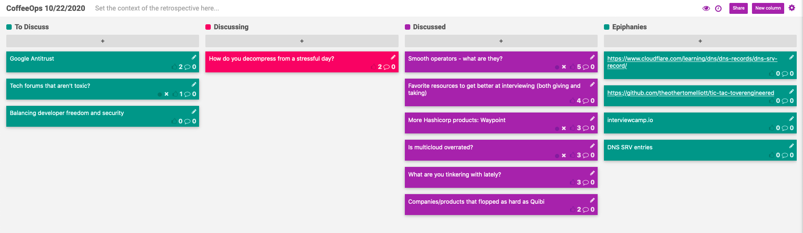

CoffeeOps 10/22/2020

All Topics
- How do you decompress from a stressful day?
- Balancing developer freedom and security
- More Hashicorp products: Waypoint
- Companies/products that flopped as hard as Quibi
- Favorite resources to get better at interviewing (both giving and taking)
- Is multicloud overrated?
- What are you tinkering with lately?
- Smooth operators - what are they?
- Tech forums that aren’t toxic?
- Google Antitrust

Epiphanies
- interviewcamp.io
- DNS SRV entries
- https://www.cloudflare.com/learning/dns/dns-records/dns-srv-record/
- 

Smooth operators - what are they?
- Reading up on kubernetes operators. Don’t make much sense. What are they?
- Instead of installing a complex app yourself, you can deploy an operator and the operator will interact with the kubernetes api to deploy the application and manage it for you
- For example, instead of deploying the entire prometheus ecosystem inside your cluster and having to manage it, you deploy the operator, and the operator will manage the installation of prom inside the cluster
- Operators interact with the kubernetes api
- Have an application with a web component and a bunch of workers. On deploy, want the workers to stop accepting new jobs, but not die until they are done with the current task. Could an operator handle something like that.
    - Sounds like more of a continuous deployment issue?
- Where does continuous deployment end and operators begin?
    - Thought that operators had more to do with migration than deployment

Favorite resources to get better at interviewing (both giving and taking)
- One weakness of interviews was algorithms and systems design, but took a course on those things and got a lot better at them. What are other resources to get better at interviews
- interviewcamp.io
- Salary negotiation: https://www.kalzumeus.com/2012/01/23/salary-negotiation/
- https://levels.fyi
- Glassdoor salary research

More Hashicorp products: Waypoint
- Continuing last weeks theme of discussing new hashicorp tools, they announced waypoint
- https://www.hashicorp.com/blog/announcing-waypoint
- Boundary and Waypoint are promising a lot, and the .1 release doesn’t have many of those features.
- Can hashicorp continue to get away with that now that they actually have a following and users?
- Seems like waypoint does way too much. Its your build, its your deploy, its your release, and its opinionated in how it works. Claims its pluggable, but how pluggable can it really be?
- If you were only using waypoint in CI, then your developers don’t have to have it installed locally, but then you might lose a lot of the power of waypoint
- The value proposition of Waypoint is that if you’re a company that deploys to multiple platforms, waypoint gives you a consistent workflow to deploy between those platforms.
- Is it kind of like Make? Its like make, if make had plugins?

Is multi cloud overrated?
- Been hearing this conversation in multiple places recently.
- Is building cloud agnostic frameworks possible/worth it?
- Failing over is NOT a valid reason to do multi cloud
- If failover is not a valid reason, then what are valid reasons:
    - Want to give customers the ability to run their integration code where they want it. If they run in AWS, then it can connect to company code running in AWS
    - Other companies might have an aversion to certain providers (cough cough AWS)
    - Specializing workloads on different cloud providers

What are you tinkering with lately?
- Bored an in quarantine, so what are you tinkering on, if anything?
- Tic tac toe game where every single square on the grid is a separate micro service
    - Reminds me of the Minecraft mod that makes all the animals pods/services
        - Reminds me of the version of DOOM where all enemies are pods and so its called a “chaos engineering” tool/game

Companies/products that flopped as hard as Quibi
- pets.com
    - The prime example of early 2000’s .com failures
- Company in the early 2000s that did same day delivery before amazon did that, and they failed fast.
- MoviePass
- Theranos
- Shipt.com
- Maybe calling it too soon, but Clubhouse, the Silicon Valley social media app that’s pretty toxic
- Maybe calling it too soon, but GameStop?
- Atrium - twitch founders making lawyers as a service (https://techcrunch.com/2020/03/03/atrium-shuts-down/)
- Juicero

How do you decompress from a stressful day?
- Eat an entire pizza
- Mario 35 (battle Royale Mario on the switch)
- Rock climbing (if that’s an option for you)
- Go for a run
- Power nap
- Taking baths
