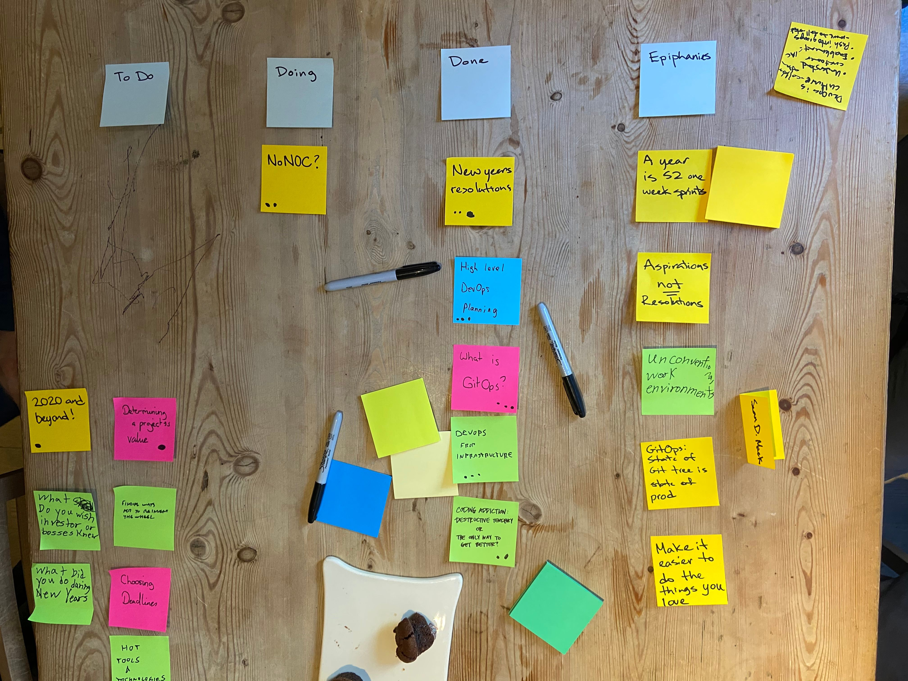

CoffeeOps 01/02/2020
8 attendees

All Topics
- New Years resolutions
- High level devops planning
- What is GitOps
- NoNOC?
- DevOps for infrastructure
- 2020 and beyond
- Determining a project’s value
- Choosing deadlines
- Hot tools and technologies
- What do you want executives and investors to know
- What did you do for New Years?
- Coding addiction? Bad habit or only way to get better

Epiphanies
- A year is 52 one week sprints
- Aspirations NOT resolutions
- Unconventional work environments
- GitOps: state of git tree is state of prod
- Make it easier to do the things you love

New Years resolutions (3 votes)
- Background: had a lot of resolutions from last year. Didn’t achieve most of them. Are resolutions worth it? What are yours?
- A year is waaaay too large a slice. Near impossible to really predict that far in the future
- A year is just 52 one week sprints
- Even a quarter is hard to predict
- Resolutions might be too strong a word. Maybe visions or ambitions?
- For some things, might be better to appreciate what you’ve got?

High Level DevOps Planning (3 votes)
- Background: Usually just DO work, don’t do a lot of planning. Now I have a need to come up with a high level, long term plan. But I don’t know what I don’t know.
- Who is the audience? Management?
- People want to hear a story, not just what the hot tool is
- Good book that is super thin called “How to Make Sense of Any Mess”
- DORA (DevOps Research Assessment) use it to figure out where your score is low and where you can improve
- People might even appreciate it more if there is pain and then you solve it
- Long term ops goals that you’re committed to are scary. You want to be flexible and respond to business needs as opposed to setting arbitrary goals
- Start with the business drivers

What is GitOps? (3 votes)
- Background: what is it?
- One understanding of it is that the state of your git tree matches your deployment. You push, you deploy.
- Really easy to see diffs of branches and see what code is in what environment this way
- Depends on your branching and deployment strategies
- e.g. 3 branches, 3 environments. Push to branch builds and deploys to corresponding environment
- GitOps for k8s tools are really hot. I think JenkinsX does this

DevOps for Infrastructure (3 votes)
- Background: Web Developer, started going to meetups, then interested in DevOps and this is a common story. Devs want to learn how to do DevOps and use those kinds of tools. Don’t see the same drive from Ops/Infra people sometimes. How as an ops/infra person can you get into DevOps easily and work with developers.
- If DevOps is just continuous improvement, you should be able to do this for infrastructure
- Infrastructure as Code tools seem like a good place to start. Take the infra that you’re already familiar with, and write some Terraform (or whatever tool) for it. 
- Then allow the developers to write their own Terraform. They write, and you review!

Coding Addiction (2 votes)
- Background: struggle to turn off brain and NOT think about tech and code. Want to get better, but don’t want to drive people away
- This is a really hot topic on Twitter right now. Some people saying you can’t get good unless you’re working on nights or weekends. Others saying that totally isn’t necessary
- Is the work you’re doing late at night impactful?
    - Its for learning and trying sake for personal
- Fresh mind is maybe better than one that’s stressed from working a lot
- Its kind of like tinkering on a car engine in your spare time
- You shouldn’t maybe have to work evenings or weekends, but…they can be really effective
- Trying to cut back on work by getting other habits
- Really don’t know whats best. 40 hours a week? 30 hours a week? 60 hours a week?

NoNOC? (2 votes)
- Background: in a traditional org you have some kind of operations center that monitors things and escalates things when stuff goes wrong. DevOps model creates more of self sufficient teams that kind of take over the role of the NOC. They are fully responsible for the full lifecycle of the app.
- In large orgs, if you are truly doing DevOps, is a NOC necessary?
- Were they ever necessary?
- Hadn’t heard the term NOC until reading the Phoenix project
- Instead of a NOC, you just let PagerDuty escalate the issue to the Dev team
- Incidents slack room and all the infrastructure team sits together. That’s basically a NOC
- We’ve turned Dev into on call for Infra. Turned the stereotypical model on its head
- What about system complexity. If things start to break, but you don’t have a specific known service causing issues, who do you page? Do you NEED someone to take a first pass and determine generally WHERE the issue is so that you can page the right teams?