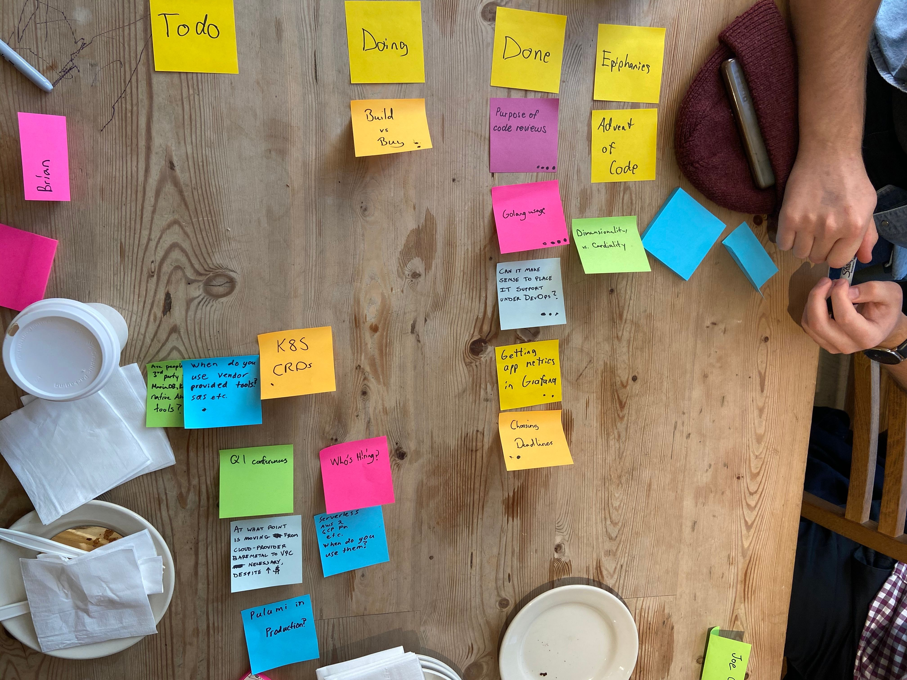

CoffeeOps 01/09/2020
9 attendees

All Topics
- Getting app metrics in Grafana
- K8s CRDs
- Choosing Deadlines
- Build vs Buy
- How many people are using third party tools instead of built in services to AWS
- Good Q1 conferences?
- Serverless. When do you think its applicable
- Does anyone use Pulumi?
- Does it ever make sense to have IT support under DevOps
- At what point is moving off of Bare Metal onto VPC worth it
- Purpose of Code Reviews
- Who’s hiring?
- Golang usage

Epiphanies
- Advent Of Code
- Dimensionality vs Cardinality

Purpose of Code Reviews (4 votes)
- Background: debate within the company about what the ultimate purpose is. What should we train people to do with code reviews? Is it quality control? Catching bugs?
- People are really BAD at code reviews
- Humans will be humans
- Code style, maintainability, readability
- Google philosophy to Code style: Use automated linting and style, and anything beyond that is nitpicking
- Bad code can be measured in “WTFs per second”
- You SHOULD have your code reviewed before merging
- But you should NOT have that wait time be very long. Ideally less than a business day. Need to keep things top of mind
- One example: two reviewers, one can be anyone, the other has to be a senior
- Another example: Blocking and non-blocking reviewers. If Security or a TL is a reviewer, its blocking, otherwise it isn’t.
- PullPanda great for Slack/GitHub to keep people on top of PRs
- Garritt is weird. Has +1s and +2s, but two +1s doesn’t equal a +2
- LGTM (Looks good to me)
- A really thorough review will run the tests, look at the tests, consider the sanity of the tests, etc

Golang usage (4 votes)
- Background: Who is using Golang in prod? What are you using it for?
- Python is fun to write because you can do anything you want. Golang is fun to write because its fast and simple.
- Golang is really popular with C developers
- In Golang there’s like usually only one way to do this, so its easy to move around code bases.
- Why has Golang become the go to language for infrastructure tooling?
    - Diaspora from Google to other infra companies
    - Easy to do concurrent programming
- What are you writing in Golang?
    - Lots of stuff. Internal tooling. Easy to get started with new services
    - Migrating a lot of stuff from datacenter to the cloud in K8s, and all that stuff is being moved to Go
    - Expected to use it a lot for services, but it also has been used a lot to build tooling for developer machines
- In Docker, because Golang binaries can stand alone, you can use FROM scratch and then your container is only as big as your binary

Can it make sense to place IT support under DevOps ( 3 votes)
- Background: That’s the current situation at $job. IT role falls under the guidance of the DevOps engineer. 
- If your company is small enough, it makes a lot of sense
- Does your company run product in house on your own hardware? That could make sense if IT needs to help with hardware to meet SLAs etc.

Getting app metrics in Grafana (2 votes)
- Background: Have Grafana. Want to get app an infra metrics dashboard there. How to? I know Prometheus is really popular, but I don’t know if I want to run it myself
- CloudWatch? 
    - Yes but really expensive
- InfluxDB?
    - Is there a lot of operational overhead?
        - Nope. Really easy
    - Querying is weak. Its a time series DB
    - InfluxDB has a StatsD interface for pushing in data
- Been trying to use metrics with Prometheus, but had difficulties with scraping
- The operational overhead of Prometheus isn’t THAT bad. Its not trivial, but you don’t have to do a crazy setup

Choosing Deadlines (2 votes)
- Background: We have this constant battle of “we need to get this done by _x_ day” and others saying “That’s an arbitrary deadline”
- Aren’t all deadlines arbitrary?
- Estimates should always come from the team themselves
- #NoAgile #NoEstimates
    - A keynote at some conference that says that if you have working software and are delivery, then no need to estimate and have deadlines
- Parkinsons Principle (Work expands to fill time allotted)
- Who is choosing the work?
    - Product Management team sets priorities

Build vs Buy (2 votes)
- Background: When do you build something from scratch vs buying from a vendor. Most interested in a tool that builds static sites in a kind of pipeline.
- As engineers we often forget the “maintain” step of the software lifecycle. Especially when it comes to something like a distributed pipeline.
- Buy first, then build when buying doesn’t scale or become too expensive.
- ALWAYS google before deciding anything. Someone has probably solved your problem before.