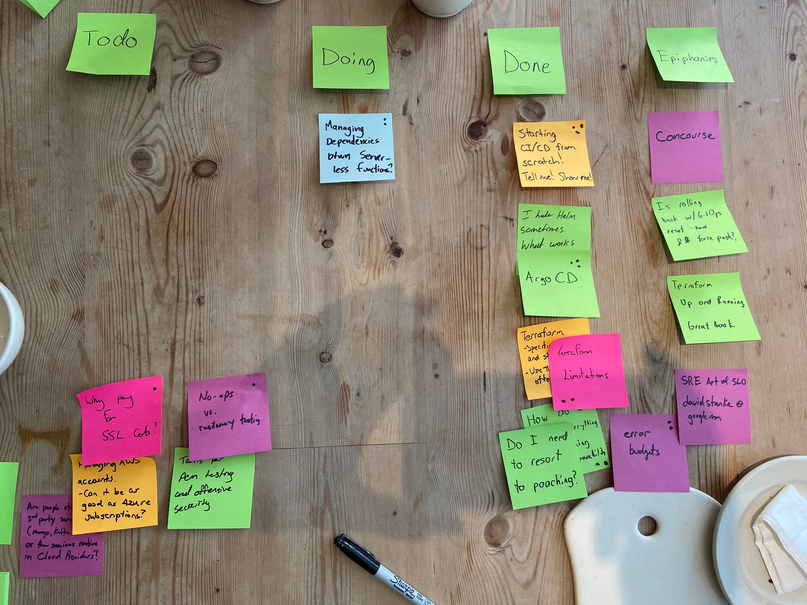

CoffeeOps 01/16/2020
6 attendees

All Topics
- Do I need to resort to poaching?
- K8s ingress controllers
- ArgoCD
- How do I prevent everything from becoming DevOp’s responsibility
- Terraform. Specifically state and storing it
- Managing AWS accounts - can it be as good as Azure subscriptions
- Starting CI/CD from scratch. Tell me! Show me!
- Terraform limitations
- Why pay for SSL certs?
- Managing dependencies between serverless functions
- Error budgets
- Are people still using third party services or full services in cloud providers
- NoOps
- I hate helm. What works for you?
- How do you QA without killing velocity
- Tools for pen testing offensive security

Epiphanies
- Concourse
- Is rolling back w/GitOps reset —hard && push -f
- Terraform up and running

Starting CI/CD from scratch! Tell me! Show me!
- Background: CTO left, we’re restarting CI and can use anything. What are best practices
- All code is hosted in GitHub.com
- How hard would switching to Docker be?
    - Not hard. Most engineers already use it
- GitHub actions would work easily along side your code
- Google Cloud Build won award for best cloud native CI/CD tool
- Sometimes it can be hard to do the CD part with tools like GitHub Actions or Circle CI since they need intimate access to your VPC or whatever
- There’s kind of the two halves of the industry. The CI tools, which struggle to do CD but are pushing that way, or the CD tools, which struggle with CI and are pushing that way. Some people say keep them separate, others say that you should get one tool that does it all
- Concourse!
- Jenkins is plugins, Concourse is containers
- There is no hosted service for concourse

ArgoCD/I hate helm What works for you?
- ArgoCD runs inside the cluster and polls a git repo. It scans for deployment yamls, detects changes, and then syncs the changes to your cluster
- Helm has some issues in that it can 
- Someone is using mostly plain yamls, plus kustomize, and then using bazel to build it all up
- Now that Tiller is gone, Helm might be even better
- There’s a terraform provider for helm, so you can use that as a crutch if you can’t directly get what you want in k8s with terraform
- Helm as a package manager is great
- In the future, maybe helm goes away, and instead you just have K8s with istio and its the responsibility of the k8s runtime to get you from state A to state B
- People like to believe that K8s is flat, but CRDs really mess things up
- LinkerD install just spits out yaml that you can use to apply

Terraform limitations/Terraform state and storing it
- Terraform Cloud is fine, but you can use Terraform’s own GitHub actions to basically do the exact same thing
- Wrote some GitHub actions to do the terraform validate/fmt/plan and spit out the plan into a comment on the PR
- Always use remote state and state locking
- Using one big state file is terrible. Try to break it up as much as possible
- Terraform up and running
- Terragrunt! Thin wrapper around Terraform to help with some of the painful parts of Terraform
- Terraform struggles with stateful infrastructure. Its all too happy to blow away databases or other stateful resources
    - End up having to make DB changes manually, then delete from TF state and import new DB into TF state
- Anything that uses secrets will end up being stored in the state file, so it needs to be encrypted and access controlled 

How do I prevent everything from becoming DevOps’ responsibility
- Background: seems like this is happening recently. Any new project and sometimes things that aren’t infra and whatever are falling into DevOps responsibility. But not everything can be DevOps’ job.
- DevOps can put together recommendations on how to do things and pass that onto the teams instead of just doing it themselves
- What would you do if you were hit by a bus
- Need to convince higher ups that responsibility needs to be diffused
- Possible idea: do rotation of engineers into the SRE/DevOps teams

Error Budgets
- Background: Error budget is when you define an acceptable amount of bugs to put into production. e.g. you don’t HAVE to fix every single bug. Some are acceptable assuming they get fixed down the line
- If you’ve gotten a certain number of tickets listed as bugs, you go into “bug jail” and can’t do feature work until you get rid of the bugs
- Error budgets at the customer experience level. Will new features or NOT fixing bugs ruin your error budget from the customer perspective?
- The theory is that if you’ve exhausted your error budget, you’ve lost significant amount of customer trust. So you freeze feature development and roll back if necessary, and then spend time fixing the app/infrastructure and roll forward now that you’ve regained the error budget since you aren’t causing those errors any more
- Fine balance between customer trust and velocity. If customer trust goes too far down, they’ll leave your product. But if you don’t release any new features, they’ll think you’re boring and also leave

Managing dependencies between serverless functions?
- Background: In serverless you have a bunch of free floating bits that don’t know anything about each other
- Is it not the same as non-serverless micro services?
    - Kinda, but at least with k8s you can define helm charts or something to deploy a group of services and test them together
- Maybe will move to instead of versioning the app, you version the data/information. Have message bodies with versions in them
- Instead of service registry/discovery, you have function registry/discovery