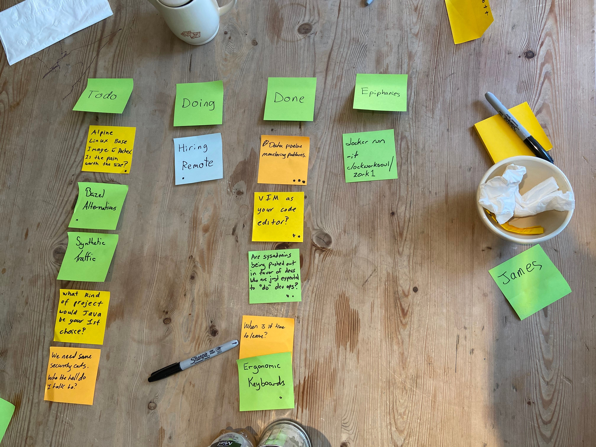

CoffeeOps 01/23/2020
7 attendees

All Topics
- Hiring Remote
- Ergonomic Keyboards
- Synthetic Traffic
- Bazel Alternatives
- Are sysadmins being pushed out in favor of dev who are just expected to “do” devops
- Data pipeline monitoring patterns
- We need sane security certs. Who the hell do I talk to?
- When is it time to leave?
- VIM as your code editor?
- Alpine Linux Base Image & Docker. Is the pain worth the smaller size
- What kind of project would Java be your 1st choice
- 

Epiphanies

Data Pipeline Monitoring
- Background: Have an ad hoc data pipeline tool. Currently have a custom solution for monitoring (with Prometheus). But hard to show job statuses etc. Prometheus likes to keep time series around and its hard to alert on job statuses.
- What is the question you are trying to answer with your monitoring setup?
    - Did my job fail? Did it run?
- Can you use your logging solution to log something specific and trigger a pager duty?
- Create an app that polls the state of the task runner itself and then alerts based on that.
- Do not want to alert on every single job failure if you get a lot of them. Probably want to alert on things like failure %
- League Table is a dedicated table that keeps track of job states
    - Write a thing that runs on a schedule to run some crazy sql queries and figure out if you need to alert
- Seems like everybody rolls their own small data pipeline. Not a big data thing, but ad hoc data pipelines

VIM as your code editor?
- Never actually done this. Used VIM here and there, but never as the daily code editor. Do you do it? Can you sway me over to your side
- Once had someone tell me about how they had their whole daily setup in Nano. Syntax highlighting, autocomplete, etc.
- You CAN get your setup just how you wanted, but why would you when something else like VS Code just works?
- One person does use Vim as a daily driver. He’s got the setup and just works. Language servers are a little rough, but it works.
    - What languages do you write?
        - Yaml
        - Python
        - Golang
- VS Code does have vim keybindings
- Relative line numbers

Are sysadmins being pushed out in favor of devs who are just expected to “do” devops
- Background: Heard about places where sysadmins are being pushed out, and not being trained on the DevOps side of things, and instead the devs are expected to do devops stuff
- Seen it both ways. Some places just expect sysadmins to spontaneously know how to code, but also seen it as expected devs to know how to sysadmin spontaneously
- SREs are just sysadmins with new titles
- “Pushed out” might not be the right term, but rather are being forced/expected to code all of a sudden
- Plenty of companies that need in house stuff that still needs the traditional sysadmin
- But many of those companies are modernizing their on prem using things like OpenStack
- Microsoft has rules of engagement for pen testing your cloud infra

When is it time to leave?
- Background: SREs/DevOps Engineers are statistically the least likely to leave their current role. Hiring is really hard. What would it take for you to leave? When is it time?
- You should always be learning, you should always be growing
- Your skills have a half-life. If you’re doing the same thing over and over again dnd not constantly learning new things, find yourself a new place to be
- Hear conflicting things about not owing companies anything, versus leaving companies too early and too often
    - Its a balance
- Algorithm problems suck
- Good whiteboard interviews are possible!
- Culture is really important. There are probably companies that you might make more money at, but think about the culture
- Depends on where you are in your life too. If you’re soon out of college, jumping jobs isn’t a terrible thing
- What if a lot of your coworkers are leaving?
    - Gotta look for the red flags. Is it natural attrition, or are there things causing people to leave
- On the flip side, if you have left and you’re looking for your next job, how do you know if the next company is a good one to join?
- One thing that is fantastic is believing in the product/mission of the company. If you do, then you feel very tied to it and and will work like hell to make it succeed

Ergonomic Keyboards
- Threw this topic in because we were talking about bad Vim bindings. But also have a tendon issue and want to know if people use ergonomic peripherals
- Gel keyboard pads
    - Don’t really work. You still rest your wrist on your nerves instead of your bone
- If you can touch type, the split ergonomic keyboards can be really good
- Videogames can make you really good at typing quickly and without looking
- Are there any good ergonomic keyboards for Mac bindings/layouts. They’re all for windows!

Hiring Remote
- Background: 
- Communication is really difficult when you have a mix of local and remote people
- Some companies do a thing that’s like “If one person is remote, everyone is remote”
- There’s also the comp problem. Do you pay NYC salary if they don’t live in NYC
- One tip, don’t hire anybody from Belarus. Its illegal for them to do it!
- Once all the efforts are made to support remote employees, it then becomes really easy to hire because its just like anything else
- The big gotcha with remote is that timezones matter. Need there to be overlap for meetings and stuff
- You have to be or have a good moderator for remote meetings. Someone needs to be able to repeat things to the people on the call etc.
- Once you go remote, the more meetings the better, because that’s where you get the interactions that you’d normally get in a physical office