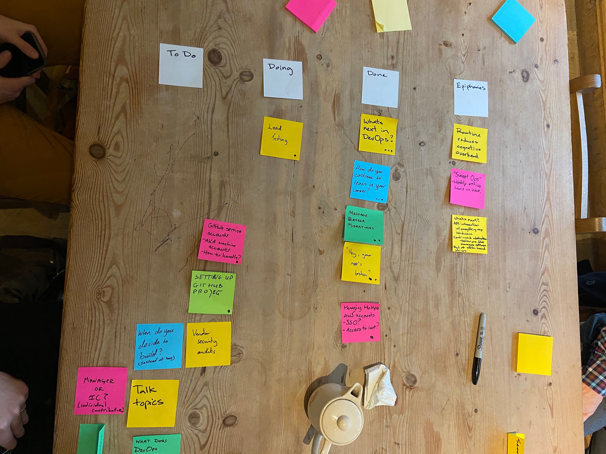

Coffee Ops 02/06/2020
8 attendees

Epiphanies
- CloudPolicy terraform examples
- SweetOps
- What’s next:
    - API Interaction especially with hardware
    - Continued abstractions, especially around stateful infrastructure

What’s next in DevOps?
- Background: I don’t know! We’re ~10 years into “DevOps” and its maturing, so what’s next?
- CNCF has a graph for kubernetes that shows adoption estimation, and they put K8s just after the “early adopters” phase and starting into the “everybody using it” phase
- Tooling is super immature! Million ways to do things
- Managing things that are already running is more mature. Puppet has been around for like 20 years
- Don’t know that codifying the tools market will ever happen. But adding new tools where there are gaps will likely happen
- Stateful things might get brought into the ecosystem. Databases and stateful things kinda got left behind by tooling
- Vitess, for horizontally sharding MySQL
    - Operator model

How do you continue to learn in your career?
- Background: Been thinking about it recently. When first got into DevOps, learned a lot of things really quickly, and now that’s started to slow more recently. Seems like there are diminishing returns. What should you spend your effort learning
- Feels like it is hard to learn new things without being super specific, or jumping into another field
- Our tooling can always improve. You can spend that time improving your tooling instead of learning new things
- If you do want to learn a new thing, how do you balance that against your actual day job?
- Set aside time on your calendar. Blocking it off so that people don’t book over it.
- Spend like two hours a day or so.
    - Do you do that on your own time? Or negotiate with your boss to take that time at work?
    - Negotiate! If its related to work, learn at work
- Do you feel that the value from those two hours blocks is apparent?
    - Maybe 50% of the time. Sometimes its kinda BS, sometimes there’s immediate value
- Make it routine/habit.
- 30 minute buckets is great, but maybe not enough for those who need to get into their flow

Message Broker Migrations
- Background: Still are using some RabbitMQ stuff. Want to migrate the nodes to somewhere else without downtime. Eventually moved to Kafka. Running into the same issues with migrations without downtime
- With Kafka, you can add new brokers, rebalance topics, waiting for it to catch up, and then rebalance without the old nodes
- Kakfa MirrorMaker
- Replication factor of 3 and then you can just start to blow things away
- Netflix treats the cluster as the smallest atomic unit

“Hey, your app is broken”
- Background: Apps aren’t working. Something is broken, alerts are coming in. How do you get the developers to care?
- What alerts are they not caring about?
- Early stage for this project, so there is no SLA/SLI/SLO. But Prometheus is failing to find an “up” instance of the app, and its alerting many times a day
- Its a preproduction app and is not serving any traffic to customers
- Can you turn the app off until they fix things?
- Sounds like the andon cord is being pulled and nobody is stopping what they are doing
- Its a cultural problem. Need to get them in the habit of responding to alerts
- Alert Fatigue

Managing multiple AWS accounts
- Background: have a few AWS accounts, some for prod, some for dev stuff. How do you manage them?
- Root billing account, and then various other accounts
- Can use AWS organizations and have sub accounts with roles that users can assume to get access to the sub accounts
- The root account is just for billing and users.
- Users then have to have profiles in the CLI to connect to each account
- AWS Control Tower

Load Testing
- Background: Been doing some load testing. Principle reason to do it right now is just testing p99 performances. How have other people doing this
- Gatling and artillery load testing tools
- Have scripts that you can totally configure for ramping up, sustained traffic, and cool down
- Locust.io
- Synthetic traffic
- Sometimes can be difficult to generate enough load from a single node generating load. Might need a distributed load test