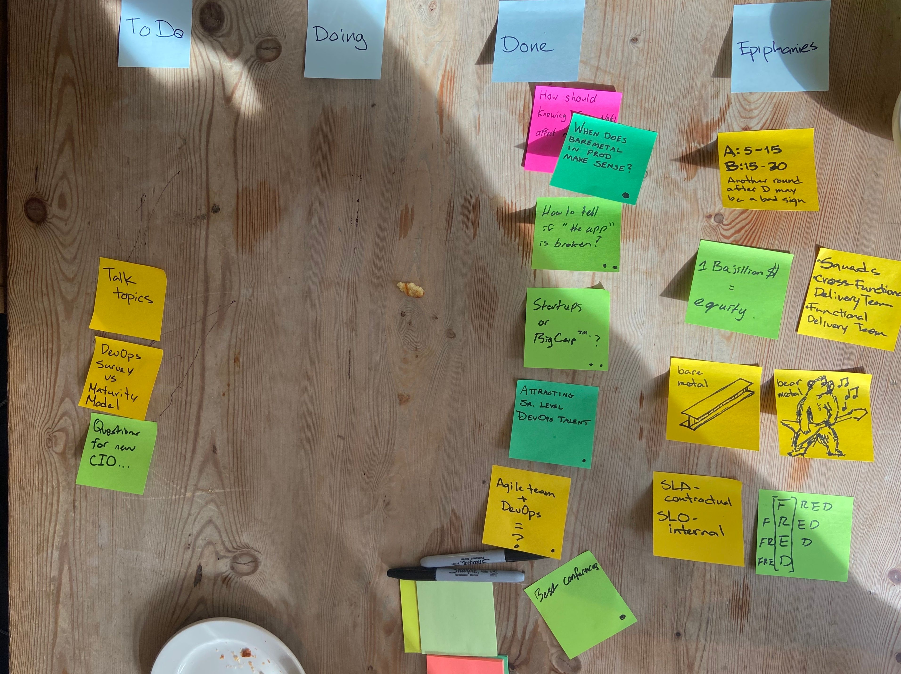

CoffeeOps 02/20/2020

All Topics
- Agile team + DevOps = ???
- Talk Topics
- DevOps Survey vs Maturity Model
- Questions for new CIO?
- When does bare metal in prod make sense?
- Attracting senior level DevOps talent
- How does knowing which round of funding affect salary negotiations
- Good conferences
- How to know the “app” is broken
- Startup or Big Corp™️

How does knowing which round of funding affect salary negotiations?
- background: interviewing at a company and they are series D, but curious how this should affect negotiations, if at all?
- Series funding rounds are official funding rounds from VC
- Series A is like 5-15mil
- B is like 15-30
- Then it gets crazy. By series D, you should have real good salary and maybe less equity, but that equity probably has real value 
- Equity is typically worthless, but it’s a bet/investment. 
- The further the company goes on though, the more likely it might be worth something
- At a series D, you should be expecting a very competitive salary though

How to tell if the “app” broken?
- Liveness checks are easy, but how can you tell more nuanced that things are working
- Need some definition of “working”
- Synthetic transactions
- Cypress E2E testing that does interactive browser testing. Can run on every Commit or after deploys or whatever to go through basic workflows
- Real user monitoring. Things like embed client side and send telemetry to the backend
- Hard to do that kind of thing with low throughput
- Sentry.io

Startup or BigCorp™️?
- Where do you work? What do you prefer?
- Big Corp can be soul sucking, but startup can be miserable too. Dogs everywhere. Ping pong table is annoying etc
- Mid size company tends to be the happy medium
- Mid size being like 500-2K?
- At a bigger or mid size company, you can go deeper on a specific topic. At a startup, you can be pulled every which way and just scratch the surface 

Attracting Senior DevOps Talent
- background: leaving current company, and they’re trying to hire a new senior engineer to fill the slot. Having trouble
- Sometimes the bar for what is senior just slowly gets lower until you find what you want. 
- Huge disparity between number of companies looking for senior DevOps engineers, and the number of actual senior DevOps engineers
- Using the community is great

Agile Team + DevOps = ???
- Squads
- Cross functional teams
- Adaptive teams
- Feature teams

Best Conferences
- DevOps Days
- SRE Con
- Cloud Native Con (Boston?)
- Dev Week New York was not great?
- PyCon, PyGotham
- Docker Con
- DevOps World
- HashiTalks (today. Online)
- Container Con
- KubeCon and KubeCon Rejects https://pca.st/episode/bcb3499a-6531-4c88-9a44-050388e554c3
- 

When does Bare Metal in prod make sense?
- running on bare metal in prod. Looking to move to cloud but struggling to justify cost
- If you have the talent to manage it, on prem can be way cheaper
- Kubernetes podcast did episode on economics. If you aren’t at like 60% utilization, then it’s likely cheaper to run in cloud
- https://pca.st/episode/3a5c78b8-3b41-4d16-9d81-6832da504ae5