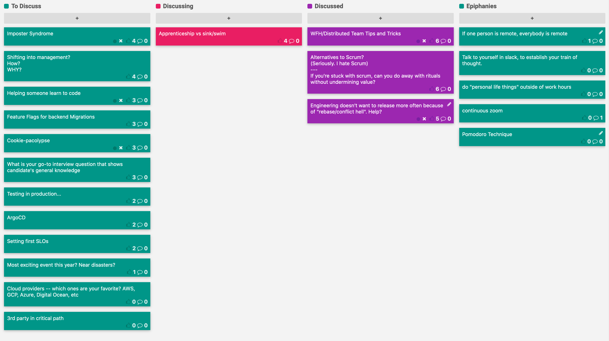

CoffeeOps 03/12/2020

Epiphanies
- If one person is remote, everybody is remote
- Talk to yourself in slack, enough to establish a train of thought
- Do “personal life things” outside of work hours
- Continuous Zoom/Hangouts call
- Pomodoro Technique

All Topics
- WFH/Distributed Team Tips and Tricks
- Alternatives to Scrum
- Engineering doesn’t want to release more often because of rebase/conflict hell
- Apprenticeship vs sink/swim
- Imposter Syndrome
- Shifting into management? How? WHY?
- Helping someone learn to code
- Feature Flags for backend Migrations
- Cookie-pacolypse
- What is your go-to interview question that shows candidate’s general knowledge
- Testing in production…
- ArgoCD
- Setting first SLOs
- Most exciting even this year? Near disasters?
- Cloud providers — which ones are your favorite? AWS, GCP, Azure, Digital Ocean, etc
- 3rd party in critical path

WFH/Distributed Team Tips and Tricks
- Go through your normal morning ritual
- “If one person is remote, everybody is remote”
- For all meetings, having everybody be on zoom or google hangouts
- Perpetual zoom call with video and mic off, but headphones on so that people can still contact you
- How do you deal with hours? Do you feel guilty if you take time or breaks? Feel more guilty than I do in the office
- Pomodoro technique
- Separate home/work even if you’re WFH. Maybe don’t do chores/home stuff during breaks. Replicate what you would do in the office.
- If possible, create a physical separation. Have a dedicated space for work

Alternatives to Scrum (Seriously I hate Scrum)/Can you do away with rituals
- Best way to demonstrate you’re delivering is to fucking deliver
- Scrum makes assumptions on homogeneity. 
- If I could keep one thing from Scrum, it would be daily standups. The touch point is valuable
- Curious that you’re trying to move to scrum when you release fairly continuously. What value are you trying to get out of Scrum?
- Agile/Scrum should be a framework. It should be flexible to fit your setup. Not a hard and fast set of rules.
- Been burned too many times by way too long standups
- Standup should be no longer than 15 min, closer to 5 if you can
- As soon as a complication comes, connect those that need to chat later, and move to next bit of work
- What problem is Scrum supposed to solve?
- It was a reaction of the context of where it came from (waterfall)
- So what is the 2020 version that is supposed to deal with 2020 problems?

Engineering doesn’t want to release more often to do “rebase/conflict” hell?
- Have brought down the time to release to daily from weekly, but engineering leadership doesn’t want to release continuously.
- Afraid of having to constantly rebase and fix conflicts, and then struggle to release because of so many rebases and conflict resolution
- What is rebasing?
    - Replaying your changes on top of commits from another branch
- Daily releases are great, but I don’t understand the fear
- Just went to CD with a monolith, and the concept is that each commit goes into production individually. Helps knowing who caused what errors in production
- Time based releases are great in terms of testing out the deployment pipeline
- Sounds like they’ve been scarred. Try testing it out on a single day, and test it out to build confidence.
- Big changes are scary for a lot of people. Small changes are exciting for a small number of people

Apprenticeship vs sink/swim
- Read an article about how as an industry we should be doing apprenticeship vs throwing people into the sea and letting them deal with it
- Is that just one persons rant? Or is this a real issue
- There are some companies that do mentorship, but they feel a bit rare
- We’re a new industry, where the people in it mostly had to figure it out themselves. There hasn’t been a lot of time to establish a pattern of mentorship/learning
- Teaching is hard. Establishing a curriculum is hard. The senior people are expensive resources, so on top of just being hard to teach generally, it can be hard to establish business value for mentorship/teaching
- Imposter syndrome can make it hard to feel like you can teach others
- How do you encourage more experienced people to not be perfect and teach others that it can be okay to NOT know stuff