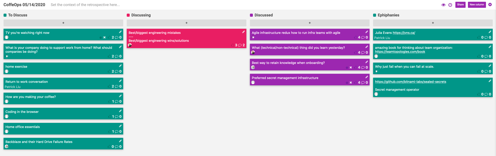

CoffeeOps 03/19/2020

All Topics
- How to make maintenance work fun?
- Hiring remote for local
- How to keep work promises / avoid making work promises at all?
- DevOps for Pandemics
- Engineering ladder. What makes a senior engineer?
- Keys to successful remote work
- Now that we have to hunt for food, where do Doritos live?
- Container management strategy. Is this a thing? If so, what are best practices?
- Do teams need to be social?
- Work from home tips?
- What makes a good engineer? (Switching to engineering from other career)
- What to do when you’re stuck - ‘writers(coders) block’?
- Top 2 most important traits of an engineer
- Web based IDEs
- Multicloud…is it real?
- What would you do if you suddenly had a stretch of free (trapped inside your house) time?
- Virtual team socializing spaces
- Serverless pros and cons?
- Best questions to ask a company during an interview?
- What do you hate/<3 about vendor sales people?
- How do you alert for only custom impacting problems

Epiphanies
- Google Drive Search: “followup:actionitems”
- Senior Engineers solve the problems you didn’t know you had yet
- If you do serverless badly, it can go horrible.
- Optional performance reviews every 4 months

Keys to successful remote work - for teams and for individuals/Work from home tips?
- How do you make remote work work well? How do you have good conversations outside of meetings?
- You have to adopt to an async work style. It is very different than an in person, synchronous style
- People are super bad about being on video calls. Bad background noise, bad video. Not aware of how they’re making the call really bad.
- Really good headphones or a good mic are a must. Helps to cut out on background noise
- You’ll quickly discover what meetings are important based on how much you’re hearing your name
- The “forever Zoom”! As long as you’re not in a meeting or on a break or whatever, join a perpetual zoom call, camera off, mic off, but whenever you want, you unmute and ask questions. Mimicking a real office
- If you have your mic always muted in calls, there’s always a weird silence, and you miss out on the laughter or banter. Should you really always have your mic muted?
- Depends on your background noise? If you have a lot of background noise, you should be muted.

How to keep work promises/avoid making work promises at all?
- I’m the person who is always like, “yeah I’ll get to that, I promise. I swear, tomorrow at the latest” and then doesn’t get it done. How do I not be that guy?
- If something is time sensitive, block it out on your calendar.
- The calendar thing is really good, and works well for time sensitive things. 
- You can keep a book that you leave open next to you that you write your tasks in.
- Saying no and not taking a commitment is great, but also hard to do.
- If you can’t deliver, how can you effectively communicate that you’re not going to meet that promise?
- Usually the other person isn’t as disappointed in you as you are in yourself.
- Everything becomes a ticket. You should track Ad hoc work the same as normal work. Otherwise you’ll just continue to do Ad Hoc work and it’ll look like you don’t actually get anything done.
- Another vote for a physical notebook. All personal stuff goes into the notebook, all work stuff goes into Jira.
- Slack reminders or snoozing emails are two features that are fantastic

Serverless pros and cons?
- I’ve tinkered with it. I always say that my next real project will be serverless and be serverless for like the first 3 years until it outgrows it
- Serverless can be a pain, but the fact that it takes care of so much for you is probably worth it.
- My concern is it is at the peak of its hype cycle.
- Requires you to do more of up front design
- When people talk about serverless, they mean that you don’t manage the compute. You give it code or a container, and the serverless system makes it happen
- If you do serverless badly, it can go horrible.
- One thing noticed when moving to serverless is the cultural mind shift. It forced the company to be more SOLID in their architecture and their code.

Top 2 most important traits of an engineer/Engineering ladder. What makes a senior engineer?
- When I’m talking to people from recruiting about what makes a good engineer, the resume might not line up, but from what I see from paper, I see someone who loves to learn, and who is passionate, and that kind of hunger is the primary thing that makes a good engineer.
- The second thing, when talking about the “genius jerk” is humbleness
- One thing about titling in general is that its specific to the company. A senior engineer at a startup is not the same as a senior engineer at a FAANG
- Senior engineers and up are the engineers who fix problems you didn’t know you had yet.
- Communication with non-technical folks, and then also technical communication.
- One trait is being a good problem solver in general. And another is humility.
- A 10x engineer exists, but they’re not someone who is 10 times better than everyone else. They make 10 other people better.
- Patience is another trait that’s really important for more senior engineers.