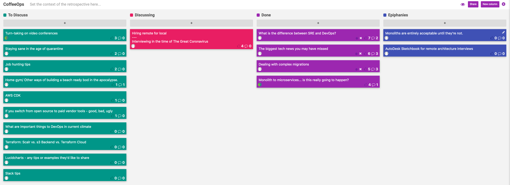

CoffeeOps 03/26/2020

All Topics
- Slack Tips
- Staying sane in the age of quarantine
- Turn-taking on video conferences
- Hiring remote for local
- The biggest tech news you may have missed
- Dealing with complex migrations
- Monolith to microservices…is this really going to happen?
- What is the difference between SRE and DevOps?
- AWS CDK
- Lucidcharts - any tips or examples they’d like to share?
- Interviewing in the time of The Great Coronavirus
- Home gym/Other ways of building a beach ready bod in the apocalypse
- Terraform: Scalr vs s3 Backend vs. Terraform Cloud
- Job hunting tips
- What are important things to DevOps in current climate
- If you switch from open source to paid vendor tools - good, bad, ugly

Epiphanies
- Monoliths are entirely acceptable until they’re not
- Autodesk Sketchbook for remote architecture interviews

What is the difference between SRE and DevOps Engineer?
- Have been interviewing and seeing job posts for both of them, and they seem basically the same.
- Seems like many times the biggest difference is the recruiter who wrote them.
- When there are years of experience on a JD, stereotypically men will ignore it, and women will respect it.
- Did the SRE term come out of Google?
- ~10 years ago, DevOps started, but also SRE started at Google. 5 years ago Google started talking about SRE
- DevOps is a set of general principles (automation, blamelessness, etc). SRE is a role that implements DevOps.
- Everyone who does SRE is doing DevOps. Not everyone who is doing DevOps is doing SRE
- DevOps Topologies (devopstopologies.com)
- DevOps vs SRE reflects the culture of the company, but not necessarily the technical maturity of the company
- Companies with DevOps engineer team tend to just make all ops things their job, where as SRE tends to be more collaborative

The biggest tech news you may have missed?
- The news is pretty dominated right now, so what big tech news might we have missed?
- Hashicorp raised a big chunk of change (https://www.globenewswire.com/news-release/2020/03/16/2001541/0/en/HashiCorp-Raises-175-Million-in-Series-E-Funding-to-Support-Multi-Cloud-Transformation-for-Global-Enterprises.html)
- Kubernetes 1.18 came out (https://kubernetes.io/blog/2020/03/25/kubernetes-1-18-release-announcement/)
- Go 0.14 came out
- WireGuard is a VPN being merged into the linux kernel (https://www.wireguard.com/)
- GitHub acquired npm (https://github.blog/2020-03-16-npm-is-joining-github/)
- Cloudflare is making some of their services free for a while given the virus.
- NASA launching 247 Petabytes of data into AWS (https://news.ycombinator.com/item?id=22626097)

Dealing with complex migrations?
- In the process of starting a complex migration from on prep stuff to cloud
- Use a cloud cost tracking services (e.g. CloudZero). Really easy to let costs get out of hand
- Aiming for a lift and shift kind of migration
- Might want to use a waterfall project tracker since that likely fits the type of work more.
- Have someone removed from the project by ~1 level to keep an eye on things and try to keep it on track
- If its a long running project, making a new team with a new project tracking style dedicated to the project is probably a good idea
- Need to have a cattle, not pets mentality because servers disappear or misbehave all the time

Monolith to microservices…is this really going to happen?
- Application modernization is fantastic, monoliths tend to limit themselves to slow release cycles, BUT can companies really decompose monoliths into microservices successfully? Do you have experience doing this, or know of companies that actually do this?
- Last 10 years have mostly been spent working at companies where they were decomposing monoliths, and not a single one has ever finished.
- Monoliths aren’t inherently bad. They’re acceptable, until they’re not.
- Strongest argument for microservices that I’ve seen is their relation to Conways Law (your software architecture reflects your team architecture.)
- Strangler pattern
- How the hell do you do versioning with microservices? Versioning is so hard
- Does it matter if you’re microservices or monolith if you have a good team? If your team is great, you could have a good monolith or good microservices

Hiring Remote for Local / Interviewing in the time of The Great Coronavirus
- We’re still trying to hire hopefully, but can’t have people on site. Can you assess how people would be in person when interviewing remote?
- Whiteboarding is really hard remotely.
- My company is trying to front load as many technical interviews as possible and then do interviews in person once we’re allowed back in the office, but that might be a lot further away than we think.
- GitLab is fully remote, but they’re interviewing remotely for a remote employee. We’re interviewing remotely to try to suss out if they would be a good in person employee (once we’re allowed back in the office)
- I could see interviewing someone remotely and them doing very well, but then when they come into the office for the job, they might not do as well in office.
- Move forward. Interview them in the new remote medium, and don’t think about what it could have been in an in-person medium.
- Autodesk Sketchbook