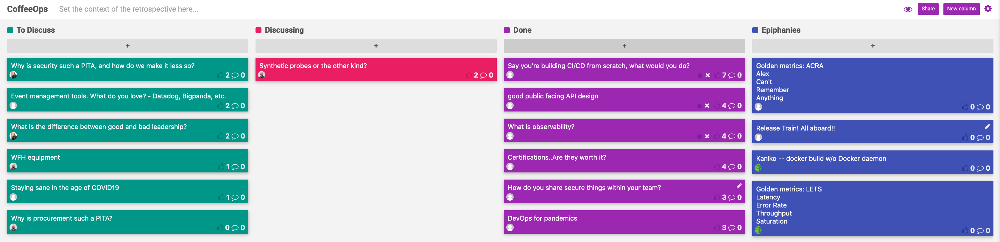

CoffeeOps 04/02/2020

All Topics
- How do you share secure things within your team?
- Synthetic probes or the other kind?
- Why is procurement such a PITA?
- What is observability?
- Event management tools. What do you love? - Datadog, Bigpanda, etc.
- What is the difference between good and bad leadership?
- Say you’re building CI/CD from scratch, what would you do?
- WFH equipment
- DevOps for pandemics
- Staying sane in the age of COVID19
- Why is security such a PITA, and how do we make it less so?
- Certifications..Are they worth it?
- Good API Design the first time

Epiphanies
- Kaniko (https://github.com/GoogleContainerTools/kaniko)
- Release Train! All aboard!
- 4 golden metrics
    - Latency
    - Error Rate
    - Throughput
    - Saturation
- 4 golden metrics
    - Alex
    - Can’t
    - Remember
    - Anything

Say you’re building CI/CD from scratch, what would you do?
- Not necessarily looking for specific tools, but what kind of things would you make sure are included? How do you deploy your CI/CD?
- Ephemeral environments is absolutely critical.
- Docker in docker has terrible performance and is really complex. Docker outside of docker is better, but has some security issues.
- https://github.com/GoogleContainerTools/kaniko
- Is triggering things manually something essential?
- Do you want a single CI/CD system, or disparate CI and CD systems
- If you have separate CI/CD systems, what decides whether or not a build goes out? Is it manual? Does it depend on what branch it was merged to? Does every commit go out?
    - It depends (table flip)
- Release train!!

Good public facing API Design
- Company has a public facing set of REST APIs. Every time we design a new product that adds to the APIs, we get stuck in a debate about the design of the API. How do you do this better?
- Having a good versioning system from the beginning makes it a hell of a lot easier
- What is good versioning? There is a good google article about versioning the data schema versus versioning the url.
- Use GraphQL and throw REST out the window. gRPC is the way to go! (That makes things harder too)
- This is a really complex problem that people have faced for a super long time.
- Under promise on how long you support versions of your API
- Avoid analysis paralysis. It’s likely more of a people problem as opposed to a technical problem.
- Dog food your own APIs so you feel the pain before the customer does
- “Eating your own dog food” - aka using your own product

What is observability?
- The ability to ask novel questions to your system and sometimes even get answers.
- I think of things like metrics, data dog, logging, etc
- Monitoring is gets alerted that your bank account is overdrawn. Observability is known that you’re spending your account down and will be overdrawn soon.
- The three legs of observability are metrics, logging, and tracing
- SaaS metrics tend to be a $$$ issue instead of a technical issue. Datadog and Cloudwatch can be really expensive when you have high cardinality metrics
- Google Stackdriver, or some other tool that allows you to set breakpoints in your code in production to help you to debug things on the fly without having to consider all metrics up front.
- If you aren’t using a SaaS like Datadog, how do you do this yourself?
    - Prometheus
    - InfluxDB
- Is there such thing as overkill when it comes to capturing metrics?
- Gotta make sure you don’t lose the signal in the noise, and there tends to be a price consideration.
- 4 golden metrics
    - Latency
    - Error Rate
    - Throughput
    - Saturation

Certifications…are they worth it?
- Are certifications, such as the AWS certifications worth it
- They might be great for you personally, or helping your company maintain relationships with a company or service provider.
- When starting out, they can force you to learn a lot of things.
- Always keep in mind that generally the certifications are created because they want you to use their product. Certifications can really just be marketing
- Studying for exams (specifically the AWS one) can really help you learn a lot
- If you don’t have a good grasp on some IT fundamentals, certifications can be good to help you learn them
- GCP certification is cloud neutral and not specific to Google (for the most part)

How do you share secure things within your team?
- Everybody does things slightly differently. You could use a password manager, or GPG, or something more intense like Vault or AWS Secret Manager
- 1Password/Lastpass
- Kubernetes secrets aren’t actually secret. They’re just base64 encoded
- Send Safely.
- If you use something like a LastPass etc, how do you reconcile getting that secret into production applications too?
    - Use a Vault as the source of truth, and then use SendSafely as a last resort
- AWS Secrets Manager with different namespaces to restrict access to production values

DevOps for pandemics?
- What are the key principles of DevOps that we can apply to the current situation.
- Loose coupling (if service A goes down, doesn’t mean service B should go down)
- Burden is shifting onto things like Amazon and Zoom
- Amazon and Microsoft are having capacity issues in their cloud
- Seeing very different usage patterns. Might mean something like drastic scale up, resource unavailability
- Socially distance your applications
- Zoom has dealt with the scale really well. Multi cloud environment has served them well.
- Assuming you are in the office network is not a great call, but VPN can help solve that, if you have one, and it can support the load. Apparently even Cisco had VPN scale issues

Synthetic probes or the other kind
- Are you sending artificial traffic to your endpoints to see if your application is still up, or just monitoring real traffic?
- Is it an OR question? Why not both?
- Real User Monitoring (RUM) vs Synthetic User Monitoring (SUM)
- SUM is great for consistent ping and ensuring you are up globally, but may miss cases that your real users are doing
- RUM falls off during off hours, where you might not know you have a problem until users start using the application again
- RUM can help you gain insight into flows and actions that are actually being used, which you can then monitor with SUM