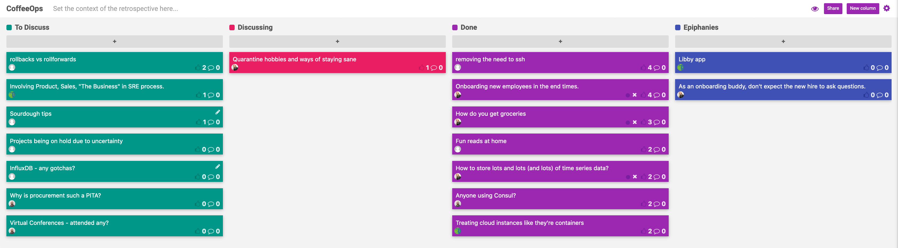

CoffeeOps 04/09/2020

All Topics
- Sourdough Tips
- Anyone using Consul?
- Quarantine hobbies and ways of staying sane
- How do you get groceries
- Projects being on hold due to uncertainty
- Why is procurement such a PITA
- Treating cloud instances like they’re containers
- Involving Product, Sales, “The Business” in SRE process
- Fun reads at home
- Onboarding new employees in the end times
- Virtual Conferences - attended any?
- InfluxDB - any gotchas?
- Removing the need to ssh
- How to store lots and lots (and lots) of time series data?
- Rollbacks vs roll forwards

Epiphanies
- Stuff

Removing the need to ssh
- Background: want to run Jenkins and give every team their own instance, but for security, don’t want to give everybody ability to SSH stuff. What do you do to make yourself feel comfortable enough to remove SSH ability
- You definitely should be able to tear it down and stand it back up again
- You should not be going into look at logs or anything like that
- Maybe make a rule that you can take an image of it and stand it up elsewhere and then shell it when it isn’t running in prod
- SSHing can be just a bad habit if people are used to doing that. Use the metrics and diagnostics available to you.
- What kind of diagnostics are you looking for that aren’t captured by something like DataDog
- Joke: re-alias the commands you would run to instead open up the dashboard in Grafana or DataDog
- Sometimes when SSHing it is because of something networking where you need to actually test it on the instance

Onboarding new employees in the end times
- Background: Still need to onboard people in these crazy times. Has anybody had any experience or thoughts on doing onboarding now?
- Assign each person a buddy so they have a go to person for all their questions and don’t have to worry about who they should go to with questions. 
- When buddying, don’t expect the new employee to ask questions. Be proactive and reach out to see how they are doing.
- Infrequent communications with HR make things hard. You tend to sit in the dark until your first day, and then it’s just a firehose.

How do you get groceries
- How are you feeding yourself in this time?
- Instacart, Costco, Whole Foods are all great….but they never have any delivery times.
- Actually going to a grocery store….the horror
- Fortunate enough to live 5 minutes away from a Trader Joes
- Some restaurants are adding stuff onto their seamless accounts. Stuff like soap, toilet paper, etc
- Restaurants that didn’t used to delivery but not deliver are amazing

Fun reads at home
- Design your Work Life from the people at Stanford
- The Unicorn Project
- Ender’s Game
- John Scalzi book The Collapsing Empire
- The entire Cradle series
- The Libby App is incredible. Put in your library card and get access to all the catalogs
- Internet Archive has released a book archive, which is great but a little controversial because they didn’t ask permission on some of the books they released
- Samuel Peep’s diary
- Brandon Sanderson is a great fantasy author
- Terry Prachet is awesome
- Have wanted to read the Witcher series since playing the games and watching the TV show
- Will always recommend Neal Stephenson
- Semiosis by Sue Burke
- Google has a new SRE book

How to store lots and lots (and lots) of time series data?
- Can we get a quick review of what time series data is and why it matters
- Time series data is a series of metrics point that have timestamps associated with them.
- For example, CPU of a particular instance in this moment at time. And it is a series, so many moments in time, so they are graph able and you can look at how the values change over time
- There are some databases specific to storing this kind of data, InfluxDB, Prometheus, or SaaS options like DataDog.
- DataDog is super expensive, what are alternatives
- InfluxDB is easy to get up and running, but unless you pay for enterprise, you can only use a single node setup
- Has anybody worked with Honeycomb (https://www.honeycomb.io/)? They are big backers of OpenTelemetry, which is now in beta (https://opentelemetry.io/)
- Prometheus has incredible compression and can store metrics in on average of like 3 bits per metric
- Are you looking for something you can host yourself and roll out, or a hosted solution/SaaS?
    - Whatever is relatively inexpensive and easy to use.
- Cortex, an open source implementation of Prometheus that’s supposedly easy to scale and operate (https://grafana.com/blog/2020/04/02/cortex-v1.0-released-the-highly-scalable-fast-prometheus-implementation-is-generally-available-for-production-use/)
- Loki, from Grafana Labs is also nice for logging (https://grafana.com/oss/loki/)

Anyone using Consul?
- Infra team used Consul for something, also been toying around with it for personal stuff, but is anybody using it?
- Just starting to use it, its one of our goals for this quarter to have it up and running. Want to use it for Service Discovery
- What is Consul?
    - Hashicorp’s service discovery tool, but it also does some service meshy things. Its like Vault, but everything is public.
    - Distributed key value store, and it has a DNS access point
    - Enterprise version that allows you to use sidecar proxies
- Hoping to stop putting your services info in configmaps in every single namespace
- Is it akin to something like Zookeeper? Yeah has a lot of similarities
- They use Zookeeper in hell to punish Ops people who have done bad things
- Using any JVM based stuff makes you feel like you’ve been put back in time 10 years
- Kafka lol, they now they are starting to get rid of Zookeeper
    - Look at NATS, a CNCF project that has more throughput and is easier to manage
- Hashicorp documentation is great, but very spotty

Treating Cloud Instances like they’re Containers
- Background: relates back to the SSH conversation. Werner Vogels said if you’re SSHing into instance, you’re doing it wrong. The things we get from Containers can be done with VMs. Interested in workflows where you use Packer and maybe one of these micro VM things. Immutable VMs that you don’t ssh into?
- Use Packer to bake your machine images. Sometimes containers are the solution and sometimes they aren’t.
- Containers and VMs have different use cases, though the process of making them is a little bit different. Baking a VM can take something a bit longer
- Packer will spin up an image out in the cloud, run ansible against it, verify it, image it, and its all described in code
- For big companies or legacy groups that are less interested in new fangled things like containers, immutable VMs baked with Packer etc might be a good way to bridge the gap
- There are times when containers aren’t the appropriate way to go.
- As someone who lives in the future and knows fancy things, when would you pick VMs over containers. 
    - Gotta run your k8s cluster on something