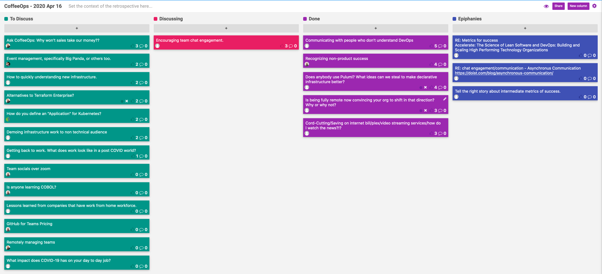

CoffeeOps 04/16/2020

All Topics
- Getting back to work. What does work look like in a post COVID world?
- Team socials over zoom
- GitHub for teams pricing
- Does anybody use Pulumi? What ideas can we steal to make declarative infrastructure better?
- Demoing infrastructure work to non technical audience
- Encouraging team chat engagement
- How do you define an “Application” for Kubernetes?
- Communicating with people who don’t understand DevOps
- Recognizing non-product success
- What impact does COVID-19 have on your day to day job?
- Cord-cutting/Saving on internet bill/plex/video streaming services/how do I watch the news?
- Lessons learned from companies that have work from home workforce?
- Is being fully remote now convincing your org to shift in that direction? Why or why not?
- Alternatives to Terraform Enterprise?
- Remotely managing teams?
- How to quickly understand new infrastructure?
- Ask CoffeeOps: Why won’t sales take our money??
- Event Management, Big Panda, or others
- Is anyone learning COBOL

Epiphanies
- Tell the right story about intermediate metrics of success
- RE: Metrics for success Accelerate: The Science of Lean Software and DevOps: Building and Scaling High Performing Technology Organizations

Recognizing non-product success
- A lot of the stuff we do is behind the scenes
- Kudos channel in slack, but its always full of launching and selling products
- How to recognize those who do supporting roles, and not just product work.
- Gotta find the way to tie the work of support to the success of the product, and then try to recognize that.
- Want to try to recognize the more mundane and tasks that should be getting done anyway to an extent. Things like developer experience improvements, increased release velocity, etc
- Don’t kudos firefighting, or overworking
- Maybe calculate a Net Promoter Score for the internal customers of the DevOps teams?
- Need to define and get buy in on what success is. Then push that definition
- Tell the right story about intermediate metrics of success

Communicating with people who don’t understand DevOps
- Have to regularly overstate what I do so that everybody understands, because nobody understands tech stuff
- They want everything to be justified in terms of cost
- Not having buy in from the top is really challenging
- The idea that having a ticket for every single thing can be frustrating. Generally want to track work, but having to have such a micro look at work can be taxing.
- Might help to have your direct manager have some buy in, and then they can help to advocate and push for the work that you’re doing, instead of having to directly justify it to the C-level execs

Does anybody use Pulumi? What ideas can we steal to make declarative infrastructure better?
- Pulumi is a library for infrastructure as code. Can be used with many languages, JavaScript, Go, Python etc.
- Is there merit to using the imperative style
- Sounds similar to the AWS CDK.
- Bridges the gap nicely for Developers who want to get interested in Infrastructure. Autocomplete really makes it much nicer to figure out all the parts of the infra.
- Imperative always has a way of sneaking into the declarative
- Imperative things in declarative is just meta programming. You’re writing imperative code to generate declarative code
- Imperative code will cut down on the lines of code dramatically

Is being fully remote now convincing your org to shift in that direction? Why or why not?
- Hasn’t seemed to push my company in that direction, curious if its impacted anybody else
- Determining how much to pay someone based on location can be difficult and contentious
- Seems like company leaders don’t like to buy into fully remote
- Previously have had a desire to have colocated offices so that even remote people are close together. Now might be better to have even smaller offices with fewer people
- The next step, after we all go back, there will be a lot less evidence of why you have to be in the office and can’t work from home a few days a week
- If our current situation continues on for a while, at some point companies will have to buy in to remote and adapt
- Never really considered it was an option to work from home because of the sheer number of meetings every day, but its totally possible to participate and be effective.
- Having only some remote employees can be a lot harder than having everybody remote

Cord-cutting/Saving on internet bill/plex/video streaming services/how do I watch the news?
- Chromecast is a god send
- Roku
- Use streaming apps
- Plex is a media server, but if you don’t have media to populate it with, then it isn’t going to do you any good.
- Most cable news is pretty bad anyway, but you can use their websites or their apps if you want to
- Plex has plugins or something to constantly keep it seeded with the most popular torrents of movies and tv, but then you’re torrenting
- Kodi

Encouraging team chat engagement
- Don’t have a great chat culture. But chat is great for community and collaboration, but don’t know what to do in order to get more people engaged in it
- Make it fun. The more emojis your slack team has, the more fun you will have
- Channels for everything
- Is there such a thing is too much chat culture?
- Too much noise will get things drowned
- Some people like to be on top of every single message, others are fine to leave things unread
- No matter what medium, like 30% of people don’t read it
- If there is a lot of back and forth, it can go in slack. If its long and needs to be persistent, it can be email.