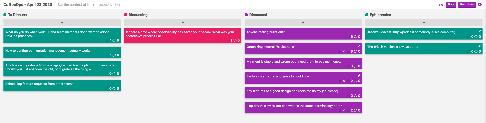

CoffeeOps 04/23/2020

All Topics
- My client is stupid and wrong but I need them to pay me money
- Factorio is amazing you all should play it
- Key features of a good design doc (help me do my job please)
- Scheduling feature requests from other teams
- Any tips on migrations from one agile/kanban boards platform to another? Should you just abandon the old, or migrate all the things
- Anyone feeling burnt out?
- How to confirm configuration management actually works
- Organizing internal “hackathons”
- Flag day vs slow rollout and what is the actual terminology here
- Is there a time where observability has saved your bacon? What was your “detective” process like?
- What do you do when your TL and team members don’t want to adopt DevOps practices

Epiphanies
- The British version is always better
- Jason’s Podcast: http://podcast.somebody-elses.computer/

Anyone feeling burnt out?
- Been struggling to recharge between meetings and projects and stuff. How have you been recharging?
- Usually go out of the apartment and go to grocery stores or something, and that isn’t an option now
- Even when things open back up, might not want to go back to the office immediately.
- Always seems like everyone else on the team is super and always getting things done
- You’d think this would be easier for us given that our work is predispositioned to remote working 
- All side projects have stalled out
- Is this burn out related to not being able to go outside? Or do you need to be in the office?
    - More variety in the day might help keep things interesting.

Organizing internal “Hackathons”
- We’ve agreed to a week of feature development pause to work on fun projects and work on different things
- Any experience with organizing these? How do you form teams? Come up with projects, etc
- Call for projects like a month out, and get list of people who are willing to lead project ideas
- Teams of 4 or 5 people
- At the end, everyone presents what they’ve accomplished.
- Key things are:
    - Having a roundup at the end so people can present
    - Allow teams to meet before so they can plan
- What kind of projects are allowed to be submitted?
    - A lot of internal tooling stuff gets submitted
    - A lot of working on pain points
    - Security exercised to build honeypots
    - Looking into new technologies
    - Cleanup task
- Almost like a tech debt hackathon
- Appropriate scoping for projects, and determining projects early
- Maybe have an explicit theme for those who can’t think of a project

My client is stupid and wrong but I need them to pay me money
- If a client pays you money to do a thing, but you think they’re wrong, how can you continue to get them to pay you, but also tell them that they’re wrong.
- It is hard to have that kind of conversation with a client who is paying you versus a manager
- Kinda have two options and one non-option
    - Option 1 might be better for consulting career in the long term is firing the product (might not be palatable)
    - Option 2 is raise objections and charge by the hour. If they want you to do dumb shit, but they’ll pay you for it, then go for it
    - Option 3 is do dumb shit in a non-billable fashion. But this is a bad idea.
- Squeaky wheel clients likely don’t stay clients for long
- Possible the client has the wrong expectations going in, or maybe their needs have change
- Solid statement of work in place, or ad hoc?
- For things they want you to do that creates more work downstream, make sure you’re billing by the hour
- If all you do is push buttons, then your value as a consultant is not as high as if you’re able to voice your expert opinion

Factorio is amazing and you all should play it
- Factorio is an amazing game where you have to build a factory and automate everything to build a rocket on an alien planet
- Automate and then automate the automation
- Super applicable to work. So many comments about observability, production outages, creating more work in the long term, etc.
- Saw liz Fong jones playing factorio.
- I’m amazed by everyone’s wherewithal to play this game
- Its super addictive
- There’s a great cycle of identifying a bottleneck, addressing the bottleneck, and then finding another one that is preventing you from doing the thing you want to.
- Logic circuits and Boolean logic allows people to make crazy shit in the game

Key features of a good design doc (help me do my job please)
- Working on a design doc and feel like things are missing. Have architecture nailed down, but there are things that are debatable of whether or not they should be in the design doc, like OKRs or how the product deliver business value
- Spec or requirements doc that came before the design? That should have the business value in it
- Feel like you shouldn’t have to justify business value in the design doc… probably should have been done before
- How deep do I go into the implementation details in a design doc
    - Not deep at all. 
- Keep it short, nobody reads a long document
- Nobody ever goes and updates the original documentation when the design changes as you work on it, so eventually the software looks nothing like the design doc

Flag day vs slow rollout and what is the actual terminology here
- Background: (I missed this, my bad)
- Preference would be slow rollout
- Support termination is powerful, because that’s the only way to get alignment. Otherwise people will continue to use an old thing that you keep supporting.
- Grease the wheels to make it easy to migrate, and then poke with a stick to encourage them to make the switch