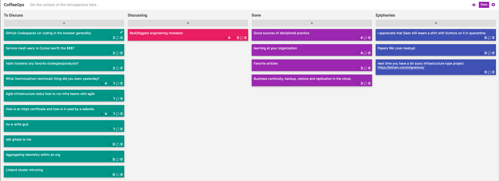

CoffeeOps 05/07/2020

All Topics
- Ho w write gud
- GitHub Codespaces (or coding in the browser generally)
- Aggregating telemetry within an org
- Talk gitops to me
- Habit trackers! Any favorite strategies/products?
- Learning at your organization
- Favorite articles
- Good sources of disciplined practice
- Service mesh wars, is Consul worth the $$$?
- What technical/non-technical thing did you learn yesterday?
- Linkerd cluster mirroring
- Best/biggest engineering mistakes!
- Business continuity, backup, restore and replication in the cloud
- Agile infrastructure redux how to run infra teams with agile
- What is an https certificate and how is it used by a website

Epiphanies
- I appreciate that Sean still wears a shirt with buttons on it in quarantine
- next time you have a bit scary infrastructure type project 
- Papers We Love Meetup

Good sources of disciplined practice
- Background: People will throw a book at you and tell you to read it and you’ll know all, but sometimes practicing by doing is much more effective, but where do you find good exercises to practice from
- Pair with someone smarter than you
- MIT and Stanford have a large chunk of their course catalog online
- Pair with someone else who has no idea what they are doing and learn together
- Some kind of DevOps bootcamp would be great
- Reach out to knowledgeable people who create content
- Seattle coffeeops
- 

Learning at your organization
- Monthly internal reviews and incident reviews. Helpful to review postmortems as a learning experience
- Tabletop exercises, Dojos, etc
- Live scenarios that you’re manipulating to learn

Favorite articles
- Seems like influential people have a list of articles that they refer to again and again. What articles do you like to read and refer to
- TLS - https://jvns.ca/blog/2017/01/31/whats-tls/
- https://lethain.com/migrations/
- Heard its great - The Soul of the new machine
- Anything written by Charity Majors
- https://speakerdeck.com/charity/a-young-ladys-illustrated-primer-to-architecture-and-technical-decision-making
- https://www.amazon.com/UNIX-Linux-System-Administration-Handbook/dp/0134277554
- https://github.com/papers-we-love/papers-we-love
- https://web.stanford.edu/class/ee384m/Handouts/HowtoReadPaper.pdf
- https://www.joelonsoftware.com/2000/08/09/the-joel-test-12-steps-to-better-code/ (Joel test is 20 years old…)
- https://irispublishers.com/sjrr/pdf/SJRR.MS.ID.000540.pdf

Business continuity, backup, restore and replication in the cloud
- How do you do it?
- What are some of the successful patterns we have
- Failing over providers in case of a third party outage
    - E.g Cloudflare to Fastly
- Even if you think of just your application and make that seamless, there’s all these third party things you use that can also fail that will probably be affected by the same things you would be
- Its mostly handling state, because things that autoscale and are containerized are typically stateless

Best/biggest engineering mistakes!
- There was a really interesting twitter thread that was talking bout engineering failures in order to show people new to the industry that its okay to mess up
- A 90 day trial period that accidentally made it into a production release and crippled all their customers
- Accidentally chown / instead of ./
- 32 bit integer overflow for a 2038 problem for a bank that was doing projections 20 years into the future. In 2018 it crippled their systems
- Production Certifications expiring
- Google.com expired in 2015
- Microsoft Word engineer accidentally made it that it would format your hard drive after 1024 saves
- Linux uninstaller for steam had installation path as an env var, and uninstaller would do rm -rf /$install_path and if that was undefined, it would nuke the whole hard drive
-