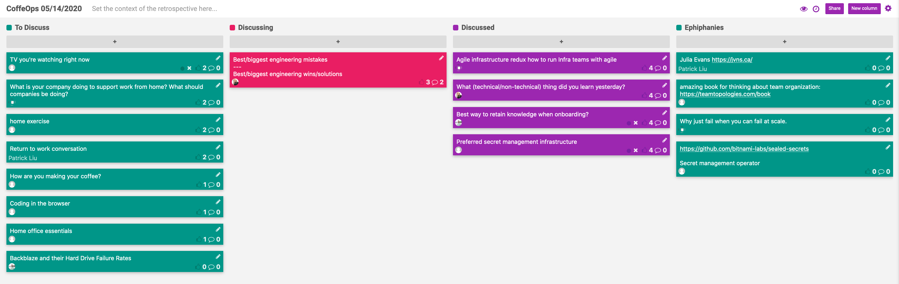

CoffeeOps 05/14/2020

All Topics
- Backblaze all their Hard Drive Failure Rates
- TV you’re watching right now
- Preferred secret management infrastructure
- What (technical/non-technical) thing did you learn yesterday?
- Return to work conversation
- What monitor should I get
- Home office essentials
- Best/biggest engineering mistakes, Best/biggest engineering wins/solutions
- Home exercise
- Best way to retain knowledge when onboarding?
- What is your company doing to support work from home? What should companies be doing?
- Agile infrastructure redux, how to run infra teams with agile
- Coding in the browser
- How are you making your coffee?

Epiphanies
- Amazing book for thinking about team organization: https://teamtopologies.com/book
- Julia Evans (https://jvns.ca)
- Why just fail, when you can fail at scale?
- Https://github.com/bitnami-labs/sealed-secrets (Secret management operator)

Agile infrastructure redux how to run infra teams with agile?
- Background: a lot of what devops is came out of a talk by John allspaw like 11 years ago about agile infrastructure
- Still a lot of infra teams are really siloed and not really doing agile delivery
- Putting a network person, or security person on every team is hard to scale, and then its hard to come up with a unified strategy across all network engineers.
- Agile is much more a method of communication over organization
- Doing agile can be really difficult when a significant portion of your work is ad hoc and is not included in the sprint planning
- Team Topologies book is great for thinking about team organization
- Do you create these new cross functional teams in place, or split them out and let them build best practices independently before trying to reintegrate

What (technical/non-technical) thing did you learn yesterday?
- Background: trying to take note of something I learn every day. Curious as to what people in this group have learned recently, technical or not, large or small
- Julie Evans web zine on containers (https://wizardzines.com/zines/containers/)
- Matt’s today I learned list: https://github.com/clockworksoul/today-i-learned
- Never attribute to stupidity what can really be attributed to opportunity cost or laziness
- It takes less energy to launch something into the far outer solar system and then redirect it to the sun than to just launch directly to the sun from earth
    - Randall Munroe (XKCD, How To, What If)
- Onboarding is way harder than I remember

Best way to retain knowledge when onboarding?
- Background: will be starting a new job in a few weeks. I’m sure I’ll be flooded with info while onboarding and training, both about the company and the work. What are some strategies for retaining a lot of knowledge from the onboarding?
- Take lots of notes
- GitHub TIL thing that I’ve been doing has been helping me to remember stuff
- Spend time adding to their documentation where there are gaps
- Give yourself a reminder to go back through everything like 2 months later. Onboarding gives you a huge onslaught and most of it just passes you by, so you have to go back and review
- Show that there is a payoff for educating you for the people that are doing the educating. 
- One thing for retention that is useful, force the new person to teach someone else something, because you can’t understand until you teach
- Give yourself a bit of slack, because you’re definitely not expected to remember everything and write everything down. You’ll learn by iterating. Learn what you need now, and then build up off that. You can’t learn everything at once
- As long as you remember enough to know that things exist and you can go look them up later, that’s enough.
- Figure out who knows what information so you can go to them for questions in the future
- Know how you learn best and then use that strategy
- Mind maps can help you figure out how things relate to each other
- Figure out what repos are important so you can go to the source code because documentation and people can be inaccurate

Preferred secret management infrastructure?
- Background: Do you use Hashicorp Vault? Do you use k8s secrets? Do you use last pass? Do you write them down?
- Working on migrating to a single solution, because right now everything is disparate and we use all of the above
- Hashicorp Vault is working really well, its just a question of adoption
- Git crypt in the repos because everything else is too much overhead for the small company
- Anyone using cyber ark?
    - Never even heard of it
- Had to build a lot of bespoke stuff around Vault to assist with the migration and make people actually use it
- Sealed secrets

Best/Biggest engineering mistakes/wins
- Accidentally ran a terraform destroy and deleted production, but was able to bring it back with terraform
- Accidentally let a domain expire
- Had a setup that would send an email on error, but then you accidentally create an error with emails that causes a recursive failure, flooding the system with failure emails
- GitHub had a really interesting postmortem about a sql network partition where they had like a 10 minute incident, but then both masters were accepting writes and they had to manually go record by record and hand fix things
- Cloudflare posted a postmortem from when they unplugged a cable in April. They had an option to do a failover, but they weren’t confident in it, so they just tried to bring things back up.
- Google Chubby service (distributed KV store) caused by the fact that they had been too lucky, so there had been no downtime, so none of the applications using Chubby were resilient to the failure. So Google started purposefully bringing Chubby down to enforce the error budget
- If you break things often enough, its considered chaos engineering lol
- Had an amplification issue where all Kafka subscribers were dropped, and when they reconnected, everything scaled up to handle the large amount of messages that had backed up. Then all those consumers slammed the database and brought down the rest of production
- Why just fail, when you can fail at scale?
- Chaos engineering be like: I need $200,000 to bring down production
- Had an issue with a contract with a co-lo and they were charging a ton for bandwidth overages. We switched to AWS and cloud flare and cut bandwidth by over 99% and cut costs from 50K+ to $200