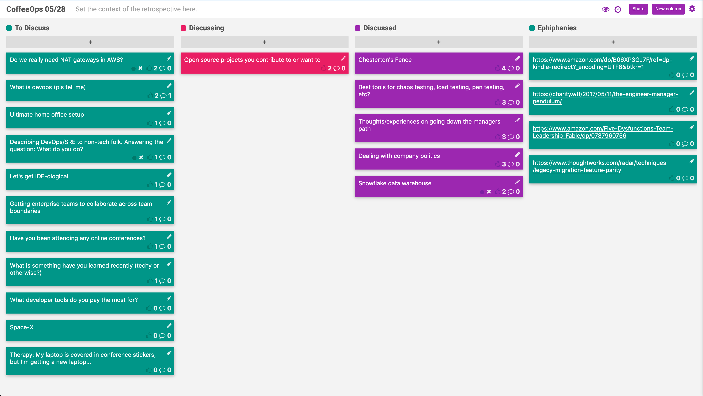

CoffeeOps 05/28/2020

All Topics
- Ultimate home office setup
- Open source projects you contribute to or want to
- What is devops (pls tell me)
- Chesterton’s Fence
- Getting enterprise teams to collaborate across team boundaries
- Describing DevOps/SRE to non-tech folk. Answering the question: What do you do?
- Space-X
- Best tools for chaos testing, load testing, pen testing etc?
- Let’s get IDE-ological
- What is something you have learned recently (tech or otherwise)
- Have you been attending any online conferences?
- What developer tools do you pay the most for?
- Snowflake data warehouse
- Thoughts/experiences on going down the managers path
- Therapy: My laptop is covered in conference stickers, but I’m getting a new laptop
- Dealing with company politics
- Do we really need NAT gateways in AWS?

Epiphanies
- https://www.thoughtworks.com/radar/techniques/legacy-migration-feature-parity
- https://charity.wtf/2019/01/04/engineering-management-the-pendulum-or-the-ladder/
- 

Chesterton’s Fence
- Background: If you find a fence in the middle of the road, you assume its there for a reason. Before you tear down wacky pieces of code, assume the person who put them there isn’t an idiot and put them there for a reason.
- Chesterton never dealt with Resume Driven Development
- It doesn’t say the fence was never put up for dumb reasons, just that you shouldn’t assume it was
- If you put monkeys in a room with a ladder that leads to a banana and spray them with cold water every time they go for the banana, eventually the original monkeys will be gone, but all the monkeys will know that they shouldn’t try to climb the ladder, even though they’ve never seen anybody get sprayed

Best tools for chaos testing, load testing, pen testing, etc?
- Scoping out a project and there’s a lot of buzz around chaos and load testing. Looking to get some ideas or recommendations
- Gremlin for chaos testing
- Locust for load testing
- Chaos testing and the tools around it don’t have to be run in production. You can run them in dev or test environments to try to help figure out where you have gaps
- Depends on your scale, but you might not need a tool. You can be the monkey and can start flipping switches and delete ec2 etc
- Chaos testing creates scenarios where things go wrong so that you can ensure that your infrastructure is able to support/recover from failures. It simulates unpredictable events
- Chaos testing isn’t just for large companies
- And there’s a difference between chaos testing and just breaking production. If you aren’t setup for HA or resilience and you start deleting EC2s or whatever, you’re just going to break things. You’re not testing your resilience at that point.
- Also need to have proper infrastructure for observing what is going on during chaos testing. Chaos testing is an experiment, so you need to be able to know what’s happening, why, and look for varying outcomes
- Load testing: Artillery.io gatling.io

Thoughts/experiences on going down the managers path
- It’s very hard to do both of being management and also improving and doing well technically. 
- Going into management might mean giving up regular time for technical work
- You get pulled in a lot of directions when people managing
- Charity Majors written some good stuff about management pendulum. Aka transitioning from IC to management/Leadership (https://charity.wtf/2019/01/04/engineering-management-the-pendulum-or-the-ladder/)

Dealing with company politics
- The number of ways people seek your attention for their own reasons are vast. Constantly getting pulled in so many directions
- Having 1:1s with key folks across all departments can help you find out a lot of stuff
- 1:1s and meetings take up so much time!
- https://www.amazon.com/Five-Dysfunctions-Team-Leadership-Fable/dp/0787960756 (https://epdf.pub/the-five-dysfunctions-of-a-team.html)
- 

Snowflake Data Warehouse
- Newer generation of cloud data warehouses
- https://www.thoughtworks.com/radar/platforms/snowflake
- Has great integrations and its really easy to get your data in and query things quickly
- Really expensive though
- Why would someone use a data warehousing solution
    - Your data gets too big for a Postgres or something
    - Really complex queries are properly segmented and handled by data warehouses
    - Columnar data storage

Open source projects you contribute to or want to
- Commits with documentation are really important
- Hard to find the happy medium of not too complex, but not too new
- The diversity of code, thought, idioms etc is much larger in open source
- It takes some finesse to work on a distributed project via PRs
- The Rust ecosystem is something that’s early that I’d want to work on
- Would be great to have a project that you can work on with friends and learn simultaneously to help assist with the complexity overhead of a project
- Company sponsored open source is hard to get people to commit to. If it isn’t on the Jira board, they don’t want to work on it.
- To contribute to open source, you have to consider the problem holistically instead of just solving the problem for you. Might make you a better programmer to do so, even if it takes a lot of time