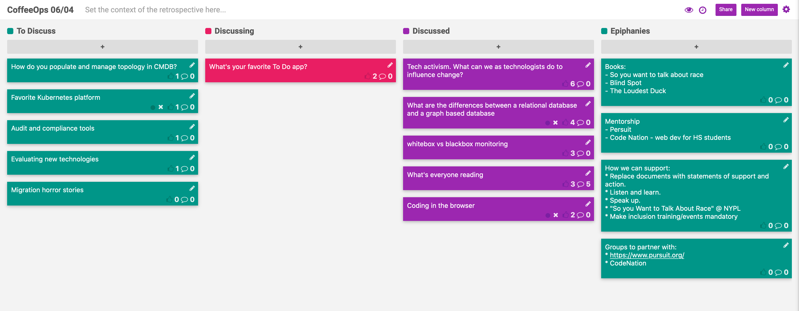

CoffeeOps 06/04/2020

All Topics
- Whitebox vs blackbox monitoring
- What’s your favorite To Do app?
- Tech activism. What can we as technologists do to influence change?
- How do you populate and manage topology in CMDB
- Audit and compliance tools
- What’s everyone reading
- Favorite Kubernetes platform
- What are the differences between a relational database and a graph based database
- Coding in the browser
- Evaluating new technologies
- Migration horror stories

Epiphanies
- Books to read:
    - So you want to talk about race
    - Blind Spot
    - The Loudest Duck

Tech Activism. What can we as technologists do to influence change?
- This is hard, and there’s a lot going on. We want to participate and help influence change, but unsure of exactly what can be done. What are you doing, what can we do to participate, whether its our current situation or others
- If you’re in leadership in company, show support, offer to match donations
- Diversity, Inclusion etc initiatives at a company need to be fully embraced, not just a separate department that you give a little bit of cash to “do diversity”
- Several high profile javascript projects took their docs offline and replaced them with educational pages on the current goings on to bring awareness.
- Treat people with respect and don’t hate people shouldn’t be a political statement
- Educate yourself! Read books etc. “So you want to talk about race”
- NY library made that book and many others free unlimited copies so you can go read or listen right now
- When hosting diversity and inclusion events, make sure that not only belonging to that group are invited and coming. You can’t educate others when you’re just preaching to the choir
- What are good hiring tools?
- Make sure you have a sufficiently diverse candidate pool. This can’t be done something passively. You have to actively engage with different groups to ensure your pool isn’t just 95% white men
- Need to start educational outreach early
- Are there good more formalized mentorship programs to help people break into the industry
    - Pursuit
    - Code Nation
    - #MentoringMonday
- Good books to check out
    - Blind Spot
    - The Loudest Duck
- Something within your own company, track and work on improving your retention numbers. If people are leaving because they don’t feel safe, that isn’t good. You want a safe workplace that people feel comfortable in

What are the differences between a relational database and a graph based database
- Just another tool for modeling data
- Graph databases are good for modeling networks or friendships or links between nodes
- Optimized to allow bidirectional links and transitive links, and query language that supports querying those things
- What are the use cases for graph databases?
    - Modeling a network graph, aka which computers can talk to other computers
    - Modeling cable companies sets of channels and packages. Want to ask questions like: which packages will give me the sci-fi channel
- A lot of graph databases are very immature
- What are some graph based databases:
    - Neo4J
    - DGraph
- High cost to switching between them because there is no one standard for query languages for graph databases.
- Book: Designing Data Intensive Applications

Whitebox vs blackbox monitoring
- A little bit familiar with these concepts but want to learn more
- Blackbox monitoring is when you can’t really inspect the internals
- Whitebox is where you can dig deep into the internals of a system
- Blackbox is really where you don’t even know the guts. You have to look at higher level infrastructure things like disk space, because you don’t know what’s going on inside
- Whitebox you can get into application monitoring and adds a lot more observability into what you know about an application
- Both are really valuable and add different insights into what’s going on from different perspectives. 
- Blackbox can be much like what the customer or user can see from the outside and what their experience is
- It isn’t really one versus the other. Its both working together for different use cases to give you the level of observability that you need

What’s everyone reading
- https://www.amazon.com/You-Should-See-Me-Crown/dp/133850326X
- DevOps Handbook
- Phoenix Project/Unicorn Project
- Crucial Accountability, which is a follow up on Crucial Conversations
- Digital Transformations
- Thinking in Bets by Annie Duke
- Google SRE Handbook
- Code
- Book groups are great for helping encourage you to actually read books, especially if they’re really dry and technical

Coding in the Browser
- GitHub announced workspaces which puts VSCode in a browser with all the plugins and setup for the specific project
- Hoping that this kind of thing helps with local development environment setup. 
- So hard to get every single dev environment to be just right and have the right versions and plugins and what not.
- Having plugins in the browser version of vscode will be a game changer
- Where’s the vim online