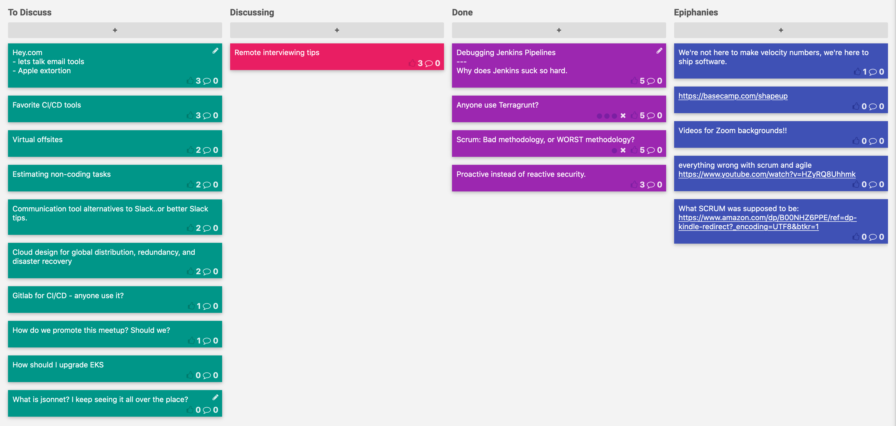

CoffeeOps 06/18/2020

All Topics
- Gitlab for CI/CD - anyone use it?
- Debugging Jenkins Pipelines
- How do we promote this meetup? Should we?
- Remote interviewing tips
- Why does Jenkins suck so hard
- Virtual offsite
- Scrum: Bad methodology or WORST methodology?
- Proactive instead of reactive security
- Cloud design for global distribution, redundancy and disaster recovery
- Anyone use Terragrunt?
- Communication tool alternatives to Slack…or better Slack tips.
- Favorite CI/CD tools
- What is jsonnet? I keep seeing it all over the place?
- Estimating non-coding tasks
- Hey.com. lets talk email tools and also apple extortion
- How should I upgrade EKS

Epiphanies 
- Videos for Zoom backgrounds

Debugging Jenkins Pipelines/Why does Jenkins suck so hard?
- If you’re developing a Jenkins pipeline, how can you test it without just testing in production, if you will
- Tons of print statements
- They call the pipelines declarative, but they’re hardly that. Mostly just bits and pieces of imperative
- Jenkins plugins documentation sucks! The primary GitHub plugins docs 404 on cloudbees website
- Since plugins are community maintained, they’re a mess!
- Updating Jenkins plugins is also a nightmare. Many don’t publish changelogs or follow any common versioning schemes
- Jenkins is so extensible that you can do anything with it, which is both a blessing and a curse
- Why groovy?? Its syntax is so weird, and its so hard to learn

Anyone use Terragrunt?
- Terragrunt is a thin layer around terraform, especially to help with DRYness in your code
- Terraform Enterprise doesn’t support Terragrunt
- What pain points does Terragrunt improve upon?
    - Having to init every single terraform workspace independently
    - Magically putting your state files where you want them
- Do you ever run into issues with debugging these things?
    - Not really?
- Does Terragrunt help with splitting up terraform into smaller states/modules, and allowing you to apply changes to all simultaneously?
    - Sort of. It has an “apply all” feature
- If you use TF version X on a workspace, you have to use version X or greater forever. No downgrading
- Terraform env can help with managing multiple versions of TF
- In Terraform, everything is a module.

Scrum: Bad methodology or WORST methodology?
- The ceremonies feel like they just take up a lot of time, and don’t actually tell you anything useful
- Many teams do sprint planning and retro on the same day, which probably takes like 2 hours, for the whole team!
- The concept of a sprint encourages legacy and bad code because you’re forced to try to fit the deadline of the sprint
- Basecamp does 6 weeks of projects and then 2 weeks of “cool down” where you finish what you couldn’t get to, make improvements, and plan the next 6 weeks of work.
- Parkinsons Law: work will expand to fill the time allotted to it
- Why is telling people to wait two weeks until the next sprint such a big deal? You should be able to plan at least two weeks out
- People like to game the velocity and burn down charts in various ways. Either stretching work so they don’t have to pull in more, or working longer hours in order to fit the deadline
- A lot of the problem seems to stem from when people try to chase numbers instead of delivering software

Proactive instead of reactive security
- Security tends to be a tight bottleneck and that might have to do with the fact that its a very reactive setup.
- What techniques exist to move security to the top of the SDLC so its less reactive?
- Looking to add automated code scanning into the CI process to catch it before it goes out
- Doing rotations onto the security team to help promote a culture of security
- How do you enable secure work but also let feature developers work on features
- IDE tools to warn developers when doing things like opening all ports to close the feedback loop
- “Zero trust security” environments where policies literally prevent devs from deploying things that break policies

Remote interviewing tips
- Starting to interview candidates remotely. What are some tips and best practices to help the process go smoothly?
- If you get the opportunity to practice with a colleague, do that!
- Close all tabs in your browser, disable notifications etc. Remove distractions so you can focus on the interview
- Notify the candidate ahead of time about what video call software you’re using so that they can test and plan to make sure that it will work
- Keep in mind that they’re a person, not just an applicant
- Interviewers forget to introduce themselves or what they plan on doing during the interview
- Give the candidates breaks!
- If they next interviewer isn’t ready, don’t make the candidate stay on the line waiting, give them a time to rejoin
- If you’re interviewing with a coworker, plan who is going to say what, and when you should jump in
- You might miss a lot of social queues via a video call. Make sure to do extra work to explain who you are, what you’re doing, etc
- It still should hopefully be fundamentally the same as a normal interview, just with extra work to coordinate and communicate what’s happening
- Be expectant that the candidate should try to engage and have video on, but be forgiving that not everyone has perfect home environments for video calls.