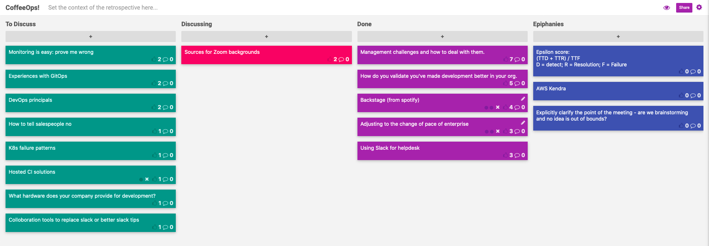

CoffeeOps 06/25/2020

All topics
- Adjusting to the change of pace of enterprise
- Hosted CI solutions
- DevOps principals
- What hardware does your company provide for development
- Collaboration tools to replace slack or better slack tips
- Using slack for Helpdesk
- Experiences with GitOps
- K8s failure pattern
- How to tell salespeople no
- Monitoring is easy: prove me wrong
- Backstage (from Spotify)
- Sources for Zoom backgrounds
- Management challenges and how to deal with them
- How do you validate you’ve made development better in your org

Epiphanies
- Explicitly clarify the point of the meeting - are we brainstorming and no idea is out of bounds? Are we talking high level and shouldn’t be debating semantics? Are we talking low level details and therefore shouldn’t question the high level?
- Epsilon score: (TTD + TTR) / TTF where d = detect r = resolution f= failure
- AWS Kendra

Management challenges and how to deal with them
- Not really a manager, but do some manager type things. Want to figure out how to deal with some of the challenges of being a manager
- High Output Management is a great book
- Specifically dealing with engineers who have difficult personalities
- Emotional intelligence is really important.
- Need to confront it in a way to see if the person is willing to address the issue
- Neurodiversity - there are a wide variety of conditions that cause people to interpret situations differently than others, so discussing explicitly how people address things can help avoid miscommunications
- At an old job, I saw a manager be very explicit about what the scope and intended outcome of the meeting is, and reminding people about it to avoid unnecessary tangents
- Raise the issue to higher ups if possible!

How do you validate you’ve made development better in your org
- Many times it falls upon SRE/DevOps to improve development experience in your organization.
- How do you actually validate that you’re improving upon it
- Metrics! Track metrics related to releases and throughput
- Track number of incidents. 
    - This can be a fickle thing. Measure Mean Time To Resolution (MTTR) instead
- Track deployment frequency
- You can game any individual metric, so make sure you’re looking at a combination of metrics
- There’s another dimension too/. There’s “what you get done”, but there’s also “how you feel about it”. Been trying to track developer happiness around tooling etc.
- Epsilon score
    - (Time to detect + time to resolution) / time to failure 
- Literally draw our your value stream and measure the time each step takes, and include waiting steps. If you’re able to 

Backstage (from Spotify)
- A unified developer portal that handles the entire lifecycle of microservices
- Can create new services, track builds, track deployments, track incidents, see who owns what services
- Extensible
- Provided UI elements to easily create new plugins with UI
- Any alternatives?
    - Deployinator, but its bad?
- Ability to track code migrations

Adjusting to the change of pace of enterprise
- Enterprise moves really slowly. A lot less expectation to be productive.
- Legacy and politics cause things to move slowly 
- Take the people who can get things done out to coffee to learn from them and build relationships
- The emphasis goes from technical development to people management and negotiations
- Enterprise is so much more willing let things get done slowly. You can just say you were fleshing things out or debating with “networking” or something and nobody cares if that takes a week
- Try to figure out the different teams and their goals so you can more easily navigate the politics later on.

Using Slack for Helpdesk
- Using slack for a Helpdesk and have an expectation that tickets get addressed within an hour. How do you track that? How can you make sure things actually get addressed in that time frame
- AI powered bots to help try to answer a lot of the low level stuff
    - AWS Kendra
    - AiSERA
- https://codeascraft.com/2018/10/10/etsys-experiment-with-immutable-documentation