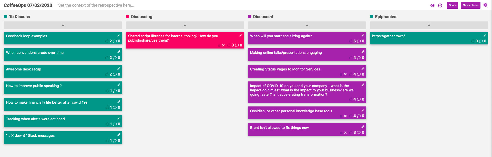

CoffeeOps 07/02/2020

All Topics
- Tracking when alerts were actioned
- When will you start socializing again?
- Brent isn’t allowed to fix things now
- Making online talks/presentations engaging
- “Is x down?” Slack messages
- Obsidian, or other personal knowledge base tools
- Creating status pages to monitor services
- Impact of covid-19 on you and your company - what is the impact on circles? What is the impact to your business? Are we going faster? Is it accelerating transformation?
- Feedback loop examples
- When conventions erode over time
- Shared script libraries for internal tooling? How do you publish/share/use them?
- Awesome desk setup
- How to make financially life better after covid 19?
- How to improve public speaking?

Epiphanies
- https://gather.town
- 

When will you start socializing again?
- Been invited to do some social things. Nervous to do social things. Should I do social things?
- Erring on the side of caution. If I socialize it’ll be distanced and with masks.
- All the places where you shouldn’t be right now (bars, clubs, restaurants) aren’t a lot of people’s jam anyway, so its easy to not go
- The north east is actually doing pretty well covid wise. We have very few cases
- A lot of us probably already have it and don’t know it
- People have different definitions of “being careful”.

Making online talks/presentations engaging
- Talks and presentations were always boring, its just more obvious now that its remote and online
- Conference talks are always so broad and so they can’t go in depth so that they reach a wider audience. The real meat never makes it into the presentation
- Online presentations, everyone is always right in front of their computer, so they can be easily distracted.
- Conversation format sometimes is way more engaging than standard presentations.
- Maybe do a video “book group”. Watch presentations on 2x speed and then discuss in a group conversation.
- Include a real time chat/comment system?
- Adding gambling to the presentation. People bet on the outcome of the presentation

Creating Status Pages to Monitor Services
- Creating a DR solution, and will be adding a status page to monitor albs and stuff
- Really want something that I can run myself on a server
- Looking for automated monitoring, not something where you have to manually flip the switch
- Use grafana. Easy to host
- staytus.co
- Have to have some established monitoring so you know what is anomalous
- If you’re already using AWS, can just use Cloudwatch Metrics, Alerts, and Dashboards. Little setup necessary and you’re probably already reporting your metrics there anyway

Impact of covid-19 on you and your company - what is the impact on circles? What is the impact to your business? Are we going faster? Is it accelerating transformation?
- When you’re in the workplace, you have those elevator or water cooler talks, and remotely, those things change. What’s your new circle of people you interact with at work?
- Had to change some sales models. Had to change some work prioritization
- From a devops perspective, things still have to GO, so we might not see that much slow down
- Telehealth/telework initiatives have accelerated greatly and 1-5 year plans in many cases are already completed
- Past job company went from only in person work to fully remote in like a month. Very quick transformation
- Anecdotal but people seem to be much faster at decision making in terms of the business. 

Obsidian, or other personal knowledge base tools
- Started at a new job and have been using it for note taking and personal knowledge base
- Wondering if other people have used it or other tools for knowledge bases
- Notion is pretty solid, but seems geared towards team usage
- Could just use Google doc
- Or text files with markdown
- Physical notepad
- Roam research
- Send emails to yourself
- More for a team, but confluence can be pretty good.
- How you decide to organize your confluence or whatever knowledge base?

Brent isn’t allowed to fix things now
- (Phoenix project reference. Brent is the talented engineer who fixes all the things)
- Have a really talented tech lead who fixes all the things. Considering taking the Brent approach and banning them from actually being the one to solve the problems. Has anybody actually done this approach before?
- Have you had a chat with the engineer about it first?
- It can be a really powerful way to force the spread of knowledge throughout the team and focus the energies of Brent on higher value add items instead of routine fixes
- Some people have a personality type of just trying to help everyone, even if they have other things they should be doing.
- If Brent ever wants to take a vacation, they need to be able to step back
- “Crucial Accountability” (https://www.amazon.com/Crucial-Accountability-Resolving-Expectations-Commitments/dp/0071829318)

Shared script libraries for internal tooling? How do you publish/share/use them?
- This has been a problem at every job I’ve worked at. How do you share and discover these scripts?
- Keybase. Private git repo synced with a remote file system with all the shared scripts, and when you merge to master, CI will notify slack that there are new scripts, and everyone has the file system mounted on their computer, so they always have latest.
- People get super eager to write shared scripts, and don’t search outside the company for solutions that already exist.
- Have a monorepo, so everyone always has the scripts.
- Would be incredible to have an internal site where you can just search keywords or phrases to find scripts that you can run or use as a jumping point to work off of.
- Put commands run during an incident into the postmortem so that people are aware of them