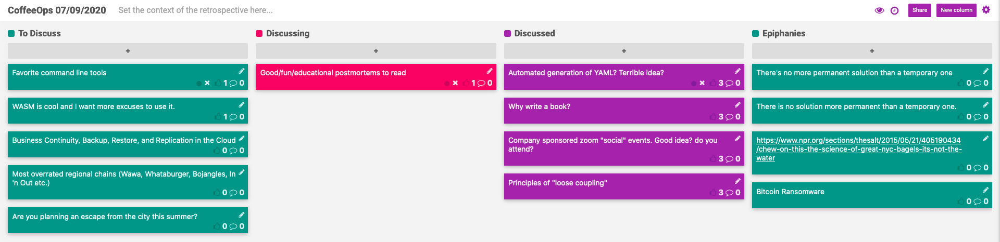

CoffeeOps 07/09/2020

All Topics
- Good/fun/educational postmortems to read
- Principles of “loose coupling”
- Favorite command line tools
- Most overrated regional chains (Wawa, Whataburger, Bojangles, In ’n Out etc)
- Why write a book?
- WASM is cool and I want more excuses to use it.
- Business Continuity, Backup, Restore and Replication in the Cloud
- Company sponsored zoom “social” events. Good idea? Do you attend?
- Automated generation of YAML? Terrible idea?
- Are you planning an escape from the city this summer?

Epiphanies
- https://www.npr.org/sections/thesalt/2015/05/21/405190434/chew-on-this-the-science-of-great-nyc-bagels-its-not-the-water
- Bitcoin ransomware
- There’s no more permanent solution than a temporary one
- Meetup to walk through a postmortem in depth
    - Walk through the timeline, what went right, what went wrong

Automated generation of YAML? Terrible idea?
- Background: have quite a few services, and someone wrote an internal tool in python that pulls in lots of values and then generates yaml for your deployments. Great, but sucks when there’s a bug. But writing by hand also sucks
- Consensus is that its a good idea for the most part
- Yaml is great, but for what it is, it still has a lot of downsides.
- Indentation/whitespace dependent stuff sucks
- Isn’t YAML generation what Jsonnet used for?
    - No clue
- Terratest (which isn’t just for terraform) has modules to test Docker configurations and kubernetes stuff etc.

Why write a book?
- Bucket list
- Public recognition/prestige
- Learn a lot along the way. Almost never go into writing a book where you know all the things ahead of time
- Money is a reason….but likely not a big reason. They don’t make much money
- Building a personal brand
- Sense of purpose/accomplishment
- Tech circles aren’t that big, so putting out good content can make you fairly recognizable
- Oreilly has been good as a publisher. Good contract and patient
- Self publishing might not bring as much prestige. You can get bigger cut of payment, but then the reach might not be as large. Takes more effort.

Company sponsored zoom “social” events. Good idea? Do you attend?
- Work did a survey and people feel more distant and not as connected.
- They host social events but they’re out of work hours and on zoom, which feels like work
- Games tend to be good, like poker, or draw that thing, since you’re actually doing a thing and being distracted
- Its easier to continue good will that you built up in person, harder if you started remote or have hired since going remote.
- It feels like it can be hard to pick up on company culture when remote.

Principles of “loose coupling”
- If you have two services, service “a” and service “b”, they are tightly coupled if “a” needs to know a lot about the internals of service “b”. Have found some other dependencies though too:
    - Shared code
    - Expected url formats
    - Temporal coupling
- Loose coupling feels like something that can be really over engineered.
- Coupling can be a big issue, especially in microservice environments. Might get into scenarios where you can’t deploy service “a” without also deploying service “b”
- When do you take the time to lay the groundwork to loosely couple? Typically you want to get work done fast so you do the easy/direct way, and eventually might hit a point where you wanted to loosely couple, and now it takes more work
- A lot of times, taking the time to think about how to structure interfaces to be loosely coupled is a lot less effort than you think it would be.
- What are patterns for moving away from tightly coupled things?
    - Hard to have patterns for this kind of thing. Its mostly rearchitecting from the ground up
    - Strangler pattern caaaan be used, but it isn’t perfect because you still have to rearchitect where the tight coupling is before you can remove the old patterns

Good/fun/educational postmortems to read
- https://slack.engineering/a-terrible-horrible-no-good-very-bad-day-at-slack-dfe05b485f82
- Google SRE book has 3-4 postmortems that are really good examples, including one with a literal fire
- Chubby postmortem. (Issue with a service being too reliable, also in the google SRE book)
- https://github.blog/2018-10-30-oct21-post-incident-analysis/
-