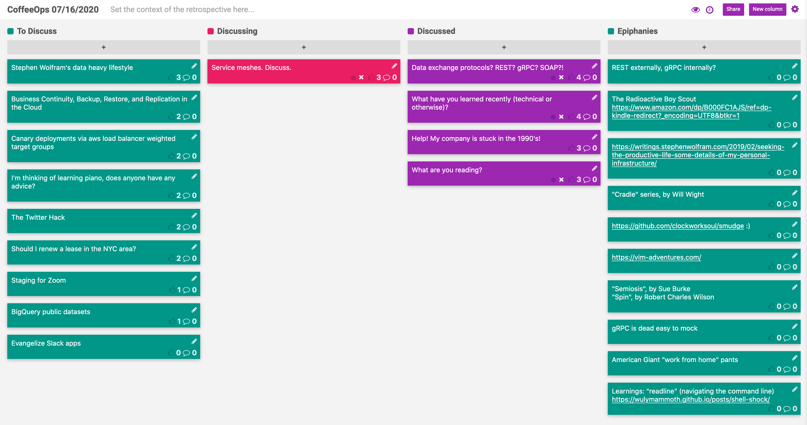

CoffeeOps 07/16/2020

All Topics
- Data exchange protocols? REST? gRPC? SOAP?!
- bigQuery public datasets
- What are you reading?
- What have you learned recently (technical or otherwise)?
- The Twitter Hack
- Evangelize Slack apps
- I’m thinking of learning piano, does anyone have any advice?
- Business Continuity, Backup, Restore, and Replication in the Cloud
- Canary deployments via was load balancer weighted target groups
- Service meshes. Discuss.
- Stephen Wolfram’s data heavy lifestyle
- Help! My company is stuck in the 1990’s!
- Should I renew a lease in the NYC area?
- Staging for Zoom

Epiphanies
- American Giant “work from home” pants
- gRPC is dead easy to mock
- REST externally, gRPC internally?
- Learnings: “readline” (navigating the command line) https://wulymammoth.github.io/posts/shell-shock/
- https://vim-adventures.com
- “Cradle” series, by Will Wight
- The Radioactive Boy Scout

Data exchange protocols? REST? gRPC? SOAP?!
- Been learning about exchange protocols in the context of loose coupling
- REST is very free for all. There’s little definition of exactly how to structure things
- REST is great since you don’t have to build a client or deal with protocol buffers
- gRPC was opened sourced by Google, now managed by CNCF. 
    - Uses protocol buffers to do strongly typed, bidirectional, automatic retries of remote procedure calls
    - Fundamentally a function call, so very easy to mock for testing
- Swagger is great for generating docs for REST APIs
- REST externally, gRPC internally?
- gRPC requires a client stub to be generated ahead of time and shared with any client who wants to consume your API
- GraphQL runs over http, but like gRPC has to define all its methods ahead of time so its self documenting. Additionally, allows clients to define which fields they want returned in the response so they only get the data that they need, and bandwidth isn’t wasted.
- Rate limiting with GraphQL is a pain

What have you learned recently (technical or otherwise)?
- Procedural generation, like creating random worlds or terrain for games
    - Uses lots of math, and algorithms like OpenSimplex to generate noise and map that to terrain elevation
- There’s a command on Mac called “open” that opens the passed in directory in Finder
- “pushd” and “popd” changes directories but also adds the directories into a stack

Help! My company is stuck in the 1990’s!
- Starting to bring in newer technologies, but there’s still a lot of people with holdups who still want to use much older technologies
- Change is scary, people like the things that they are used to
- Changing the mindset towards utilizing managed services is difficult
- Build a consortium of folks who are excited about the changes and get them on board
- Doing large scale updates/migrations like this creates a lot of little headaches that people don’t want to deal with sometimes
- Need to find out what benefits the new technologies provide that would solve existing pain points
- Migrations can take a long time, and it can be really painful to maintain the old and the new way of doing things at the same time
- For a long time, there’s only been one way to host these kinds of things, and the people who like knowing how those systems work, and like solving issues with them are the people who are employed doing infrastructure. Having to give that all up for new modern solutions isn’t very attractive
What are you reading?
- Cradle series, by Will Wight
- Snowcrash
- Foundation
- Dune
- Left Hand of Darkness by Ursula Le Guin
- 1984 by Orwell
- Brave New World by Aldous Huxley
- Robert Jordan’s Wheel of Time
- Andy Weir: The Martian/Artemis
- Spin by Robert Charles Wilson
- Symbiosis series
- The Radioactive Boy Scout

Service meshes. Discuss.
- Service mesh…explain?
    - It is a layer over the networking layer that uses internal service discovery to find other services and allows applications to communicate over this network, which abstracts away things like mTLS, retries, throttling, etc.
- Pushing networking into the application layer
- Typically runs as a sidecar inside a kubernetes cluster.
- The sidecar does the service discovery, health checks, network retries, mTLS, etc.
- Service discovery is a single, but large component of service meshes. It is extremely helpful for places where components are ephemeral, and don’t necessarily live in the same place all the time.
- What problems are you trying to solve with service meshes?
    - Service discovery
    - mTLS for encryption even internally between pods and handles certs for you
    - Tag based routing, blue green deployments
- As an application, how do I use the service mesh? If I’m a python or node application, how do I work with Istio?
    - Mostly just run it
    - There might be a registration step for service discovery
- Examples: Istio, Linkerd, Maesh, Consul
- Infection Protocol, Swim (https://github.com/clockworksoul/smudge). Raft is a consensus protocol.