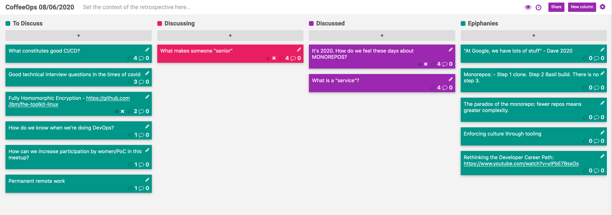

CoffeeOps 08/06/2020

All Topics
- What is a “service”
- Permanent remote work
- Fully Homomorphic Encryption (https://github.com/ibm/fhe-toolkit-linux)
- It’s 2020. How do we feel about monorepos
- How can we increase participation by women/PoC in this meetup?
- What makes someone a “senior” software engineer
- What constitutes good CI/CD?
- Good technical interview questions in the time of covid
- How do we know when we’re doing DevOps

Epiphanies
- “At Google, we have lots of stuff” - Dave 2020
- Monorepos: Step 1 clone. Step 2 Basil build. There is no step 3.
- “Enforcing culture through tooling”
- The paradox of the monorepo: fewer repos means greater complexity
- Rethinking the Developer Career Path: https://www.youtube.com/watch?v=yIPbE7BssOs
- 

What is a “service”
- “A collection of jobs that are typically deployed together to do a thing”
- “A process you run”
- “A kubernetes object”
- “A pointer to a workload”
- “An RPC function that returns a ‘service’ object” 
- “Systems boundaries are represented by asynchronous functions called services. They provide a symmetric and uni-form API: the same abstraction represents both clients and servers.” (https://monkey.org/~marius/funsrv.pdf)
- An abstraction that’s tied to your job that allows you to talk about the system without necessarily exposing the internals
- Anything as a Service (aaS)

It’s 2020. How do we feel about monorepos?
- Normal repo situation is where each application has its own git repository.
- Monorepo is one big repo, where multiple teams work on multiple applications all within the same repo
- Building a monorepo is where things start to get more complicated
- Is monorepo a goal? Is it something people want? How are we doing with monorepos?
- You NEED good tooling to support the monorepo, or it will be miserable.
- Google has a “One Version” policy, where each app can only have one version in the monorepo, and if a team wants to update it, they are responsible for making sure that all people who depend on it are functional.
- It seems that the companies that have been really successful with monorepos have a dedicated team responsible for tooling related to the repo and builds etc.
- How is storing all shared code in a monorepo different than just publishing a versioned library?
    - Basically forces users to recognize when things break and fix it before they actually merge and publish
- Step 1 clone. Step 2 Basil build. There is no step 3.
- In a monorepo its really easy to make crazy dependencies, and hard to keep track of where you are importing functions from.
- Do you have to start with a monorepo? Can you migrate to one? Is it something that companies do when they hit a certain size or expertise?

What makes someone “senior”?
- What helps someone grow into becoming a “senior” engineer? What are the characteristics of a senior engineer?
- Rethinking the Developer Career Path: https://www.youtube.com/watch?v=yIPbE7BssOs
- The size/type of the company probably greatly impacts who is considered “senior”
- A Senior engineer is someone who accelerates the team that they work on
