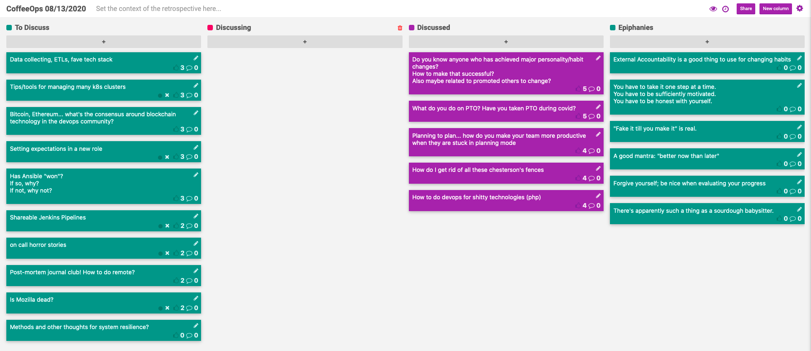

CoffeeOps 08/13/2020

All Topics
- Is Mozilla dead?
- How to do devops for shitty technologies (php)
- How do I get rid of all these chesterson’s fences
- Has ansible “won”? If so, why? If not, why not?
- Shareable Jenkins Pipelines
- Methods and other thoughts for system resilience?
- Tips/tools for managing many k8s clusters
- On call horror stories
- What do you do on PTO? Have you taken PTO?
- Post-mortem journal club? How to do remote?
- Do you know anyone who has achieved major personality/habit changes? How to make that successful? Also maybe related to promoted others to change?
- Data collecting, ETLs, fave tech stack
- Setting expectations in a new role
- Planning to plan…how do you make your team more productive when they are stuck in planning mode?
- Bitcoin, Ethereum…what’s the consensus around blockchain technology in the devops community?

Epiphanies
- External Accountability is a good thing to use for changing habits
- You have to take it one step at a time. You have to be sufficiently motivated. You have to be honest with yourself.
- “Fake it til you make it” is real.
- A good mantra: “Better now than later”
- Forgive yourself; be nice when evaluating your progress
- There’s apparently such a thing as a sourdough babysitter
- Tactical tornadoes - from the book Philosophy of Software Design. (Someone who gets a lot done but wrecks everything in the process) https://www.amazon.com/Philosophy-Software-Design-John-Ousterhout-ebook-dp-B07N1XLQ7D/dp/B07N1XLQ7D/ref=mt_kindle?_encoding=UTF8&me=&qid
- 

Do you know anyone who has achieved major personality/habit changes? How to make that successful? Also maybe related to promoted others to change?
- Therapy can cause personality to change
- Personality is your habitual style of reacting to things and how you see things, which can be changed
- Its much easier to accomplish meaningful change in yourself when you are sufficiently motivated to make change
- It can be easier to change once you’ve “hit bottom”, but that concept can be harmful
- Taking on too many changes at once can make it harder to actually make a change
- Make a change for a concrete reason. Deciding to get up at 6am just because will be harder to maintain than getting up at 6am for a specific purpose.
- Having a community doing the same tasks can help you to be motivated. Can even be something you pay for (coaches, instructors, etc)
- “Fake it til you make it” is real
- Better now than later

What do you do on PTO? Have you taken PTO?
- What do you do if you’re not traveling? Hard to take time off if you’re just sitting at home
- Do literally anything other than work. Play video games. Tend to your garden. Play an instrument. Do those side projects
- Take some kind of class into a hobby that isn’t something that you normally do
- Learn a new skill!
- Switch up your habits just to make it feel novel.
- Sourdough. It will eat up a lot of your time

Planning to plan…how do you make your team more productive when they are stuck in planning mode?
- “I have a mantra: Fuck it, I’ll do it” - Matt 2020
- Plan less, but make frameworks for iteration more
- Definitely plan, but only as much as you need to, and no more.
- You need to know what the scope of the planning is. To what degree are you planning?

How do I get rid of all these Chesterton’s fences?
- Chesterton’s fence: concept that you can’t remove old, unexplained things, until you can figure out why they were put there in the first place.
- How can you do the investigation to find out why the fence was installed? What if the person who built the fence in your org is long gone?
- Code can be a lot easier to figure out than process related things or dynamically loaded things.
- Startups encounter the fence in the middle of nowhere and are more inclined to destroy it. Enterprises encounter the fence and build a whole city around the fence without touching it.
- It’s always obvious in hindsight what the mistake was in destroying the fence.

How to do devops for shitty technologies (php)
- Being able to come up with modern solutions to older problems is a really high value talent. If you can get closer to modernity with an outdated tech stack is very desirable
- But it is also really painful
- There’s a reason people are hiring consultants to do this kind of thing
