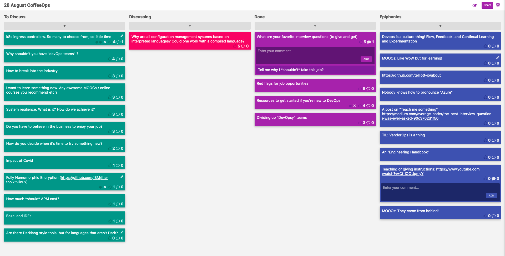

CoffeeOps 08/20/2020

All Topics
- K8s ingress controllers. So many to choose from, so little time
- Resources to get started if you’re new to DevOps
- Why are all configuration management systems based on interpreted languages? Could one work with a compiled language?
- Are there Darklang style tools but for languages that aren’t Dark?
- System resilience. What is it? How do we achieve it?
- Dividing up “DevOpsy” teams
- Fully Homomorphic Encryption (https://github.com/IBM/fhe-toolkit-linux)
- How to break into the industry
- Red flags for job opportunities
- What are you favorite interview questions (to give and get)
- Do you have to believe in the business to enjoy your job?
- Impact of Covid
- Bazel and IDEs
- How much *should* APM cost?
- Why shouldn’t you have “devOps  teams”
- How do you decide when it’s time to try something new?
- I want to learn something new. Any awesome MOOCs/online courses you recommend etc.

Epiphanies
- MOOCs: Like WoW but for learning!
- MOOCs: They came from behind!
- A post on “teach me something” https://medium.com/average-coder/the-best-interview-question-i-was-ever-asked-90c3702d1f50
- Teaching or giving instructions: https://www.youtube.com/watch?v=Ct-lOOUqmyY
- https://github.com/telliott-io/about
- DevOps is a culture thing! Flow, Feedback, and Continual Learning and Experimentation
- Nobody knows how to pronounce “Azure”
- TIL: VendorOps is a thing
- An “Engineering Handbook”

What are your favorite interview questions (to give and get)
- Given our audience, probably skewed towards platform engineering or DevOps kind of questions, but open to whatever
- “How do you resolve conflict?”
- “Teach me something”
    - Give them a few minutes to come up with something and then they have to teach you something
    - Shows their ability to teach others
    - Shows their ability to break something down quickly without a lot of prep
    - As you continue in your career, more and more of your job is teaching people things
- “What does engineering mean to you”
- “Describe a time you’ve taken a risk”
- While interviewing, ask “why you shouldn’t take the job”, which allowed the interviewer to talk about how personalities might conflict with the role or negative aspects of the company
- If the person will be someone who codes, set aside time to pair with them
- When interviewing for DevOps, do you get really technical questions, white boarding, etc?
    - Mixed bag. Definitely will be some technical questions, but likely not hacker rank style coding algorithm challenges. Whiteboarding will likely be for architecture questions
    - More likely there will be more questions about devops theory and culture, and concepts

Red flags for job opportunities
- Got a recruiter reaching out for a company founded by the guy who founded Uber. What are other red flags
- They might include details about time and budget that reveal culture you don’t enjoy
- Might include things like “12 years in Ethereum”, which has only been around for a few years, so clearly they don’t even know their own domain
- “Rockstars” and other terminology that doesn’t sit well. “10x engineer”
- “We have a lot of ex googlers” - what does that even mean?
- Can’t understand what the business does. Might be a red flag for some people
    - Do I believe in the business or have passion for it
    - Is this an ethical business? Can I live with what the business does?
- “Serial entrepreneur”
- Urgency for the job

Resources to get started if you’re new to DevOps
- Software developer turned DevOp. Lots of stuff like containers and micro services and scaling etc. How do I learn about this.
- DevOps Handbook. Phoenix Project. Unicorn project.
    - https://www.amazon.com/DevOps-Handbook-World-Class-Reliability-Organizations/dp/1942788002
    - https://www.amazon.com/Phoenix-Project-DevOps-Helping-Business/dp/1942788290
    - https://www.amazon.com/Unicorn-Project-Developers-Disruption-Thriving/dp/1942788762
- Google SRE book
- Make a bunch of mistakes. That’s one of the best teachers out there, is your past experience
- If you’re the kind of person who learns by doing, just start doing it. Spin up kubernetes clusters. Deploy CI systems. Create containers. You don’t necessarily have to do it at a crazy scale to understand it.
- Web Operations by John Allspaw
    - https://www.goodreads.com/book/show/8571725-web-operations

Dividing up “DevOpsy” teams
- Manage a group that’s concerned with a lot of DevOpsy type things. Going to be splitting them up. How should we do it?
- https://teamtopologies.com/book
- Need good engineering documentation so that people follow guides and do things properly to help facilitate communication and standards
- How much do team goals overlap? Should each team be self sufficient or do you embed experts within other teams?

Why are all configuration management systems based on interpreted languages? Could one work with a compiled language?
- All the major configuration management tools (Ansible, Puppet, Chef) use either Python or Ruby. Why can’t we use something like Go binaries?
- Python and other interpreted languages are easy to pick up and learn
- CFEngine uses C
- Interpreted languages are an evolution from older school stuff that was a big pain to deal with. Easy to debug python compared to C
- Terraform is releasing TypeScript and python CDKs to compete with Pulumi, so maybe that’s just what the people want.
