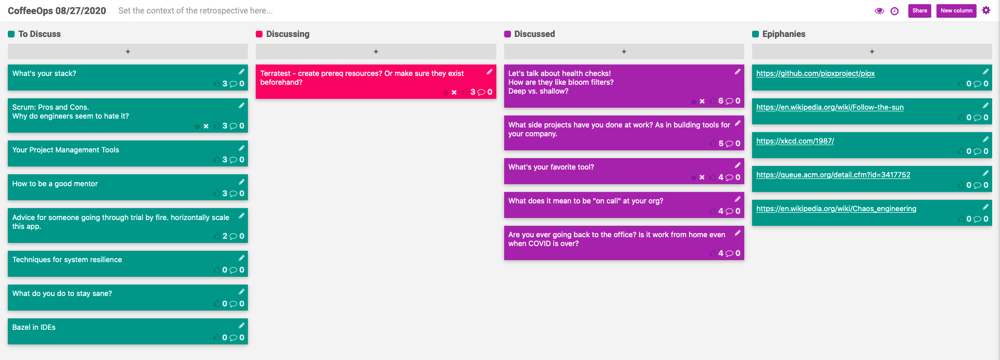

CoffeeOps 08/27/2020

All Topics
- Your Project Management Tools
- Terratest - create prerequisite resources? Or make sure they exist beforehand?
- What’s your stack?
- What does it mean to be “on call” at your org?
- Techniques for system resilience
- Let’s talk about health checks! How are they like bloom filters? Deep vs. shallow?
- Advice for someone going through trial by fire. Horizontally scale this app.
- Are you ever going back to the office? Is it work from home even when COVID is over?
- Bazel in IDEs
- How to be a good mentor?
- What side projects have you done at work? As in building tools for your company.
- Scrum: Pros and Cons. Why do engineers seem to hate it?
- What do you do to stay sane?
- What’s your favorite tool?

Epiphanies
- https://en.wikipedia.org/wiki/Follow-the-sun
- https://en.wikipedia.org/wiki/Chaos_engineering
- https://xkcd.com/1987/
- https://queue.acm.org/detail.cfm?id=3417752
- 

Let’s talk about health checks! How are they like bloom filters? Deep vs. shallow?
- Been thinking a lot about resilience, and reading a lot about health checks. 
- A failed health check tells you the service is down, a successful one tells you the service is “probably” up.
- Shallow health checks just return a 200 and tell you whether or not the service is “up”, not whether or not its working
- Where do “heartbeats” fall into this
    - Heartbeats usually are a push back to a central server and are used common in distributed systems
- A shallow health check won’t necessarily check that the service is well configured and has all the of the secrets that it needs etc
- You don’t necessarily want to totally kill a service if it can’t connect to a database or a downstream service, because this can cause cascading failures, and then retry storms when the database comes back up
- Instead you might want to do a retry with backoffs to prevent spamming the downstream connection
- One pattern might be to do a shallow-ish health check, but include information about the status of downstream dependencies in the response
- Do synthetic health checks using Selenium to do end to end tests.
- Chaos engineering to inject problems to validate that health checks are accurate

What side projects have you done at work? As in building tools for your company.
- Finding issues within your company and then building tools to address those problems
- Made tools to validate IAM permissions
- Made tools to scaffold new services
- Made tools to rewrite stuff in ansible to automate processes
- Automate new hire computer setup with ansible
- Tool to generate docker run commands with all the proper proxy settings for the corporate network
- Made a service that tracks batch operations across tons of services and can generate reports
- Finding time to actually automate stuff and work on these helpful tools can be difficult because you’re probably spending all your time doing these things manually

What’s your favorite tool?
- PipX is useful for wrapping virtual environments for python tools (https://github.com/pipxproject/pipx)
- Ansible is really useful for managing various linux servers
- https://github.com/cantino/mcfly
- https://kind.sigs.k8s.io/

What does it mean to be “on call” at your org?
- You don’t really get incentivized to do support work or on call. Mostly recognized for creating new projects
    - Kudos channels in slack to recognize exceptional work
        - Can quickly turn into only recognizing heroes or firefighters instead of actual good normal work
    - Reward teams for maintaining SLOs or avoiding incidents
- If it becomes necessary, try to get actual numbers of allowable incidents etc from the higher ups to give you a definitive goal to work on. Once its been admitted that some amount of downtime is okay, it takes a lot of pressure and stress off the team
- When on call, how do you actually track the amount of work that comes in.
    - Create a ticket for on call work, and adjust the points as things come in.
    - Only take at most 60% of your normal load when on call

Are you ever going back to the office? Is it work from home even when COVID is over?
- We’ve adapted to remote. Want to be fully remote at least 3 days a week
- Feel like we’re now able to be just at productive from home
- Would be ideal to have the flexibility. Want an office nearby that you can optionally go to, but primarily work from home

Terratest - create prerequisite resources? Or make sure they exist beforehand?
- When testing a module (say an ALB), you require a VPC and subnets etc. Do you create all those resources within the test? Or use accounts that have that prerequisite infrastructure already there?
- One option: have accounts that have prerequisite infrastructure already there and tag that infrastructure for terratest, and then dynamically use those resources in terratest
- Depends on the nature of your team and tests. One challenge with having preexisting resources can mean that you have to have accounts that can’t be touched or modified or all your tests will break. Can have difficulties with running more than one test at the same time.
- Kind is really useful for doing terratest with kubernetes
- Have something that recreates and resets your testing environment daily to prevent drift?
