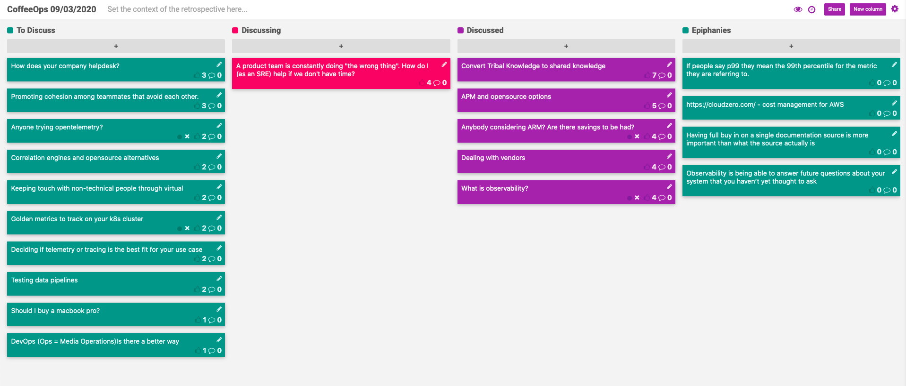

CoffeeOps 09/03/2020

All Topics
- Keeping touch with non-technical people through virtual
- Convert Tribal Knowledge to shared knowledge
- How does your company Helpdesk?
- APM and Open-source options
- What is observability?
- Golden metrics to track on your k8s cluster
- Correlation engines and Open-source alternatives
- DevOps (Ops = Media Operations) is there a better way
- Deciding if telemetry or tracing is the best fit for your use case
- A product team is constantly doing “the wrong thing”. How do I (as an SRE) help if we don’t have time?
- Anyone trying open telemetry?
- Promoting cohesion among teammates that avoid each other.
- Testing data pipelines.
- Dealing with vendors
- Anybody considering ARM? Are there savings to be had?
- Would you still buy a MacBook Pro?

Epiphanies
- If people say p99 they mean the 99th percentile for the metric they are referring to.
- Having full buy in on a single documentation source is more important than what the source actually is
- Https://cloudzero.com - cost management for AWS
- Observability is being able to answer future questions about your system that you haven’t yet thought to ask

Convert Tribal Knowledge to shared knowledge
- Continuing a conversation from last week. Big gap in experience at company. A large chunk have been there for more than a few years, and a large chunk have been there less than a year. Lots of tribal knowledge that the second chunk doesn’t have access to
- Where do you store all this knowledge so its in one place?
- If you opt to use slack, need to get people to get in the habit of putting answers in public channels and searching for things before you ask
- Having full buy in on a single tool is more important than the tool you use itself
- A part of your onboarding should be improving the documentation to make the experience better for the next person
- Apart from the culture issue of getting people to search/answer questions, a huge issue is having too many knowledge bases

APM and Open source options
- APM is really expensive, but also seems to be kind of an emerging field of monitoring. What are you using? Are there good open source alternatives
- APM is application performance monitoring
- Either pay for Datadog, New Relic, AppDynamics?
- Honeycomb auto instrumentation tools are really cool
- Custom setup with Prometheus and Grafana and Lightstep
    - Could use something like Jaeger instead of lightship
- Sentry.io is great for error tracking at the application level

Anybody considering ARM? Are there savings to be had?
- https://aws.amazon.com/podcasts/383-diving-into-aws-graviton2-processors/
    - Good episode of the AWS podcast that goes over some of the benefits of ARM
- ARM not vulnerable to the Spectre and meltdown attacks
    - But hypothetically still vulnerable to cpu based attacks
- What would you need in place in order to make a switch to ARM happen? Want to consider it because it would save a lot of money
    - In terms of saving money, take a look at CloudZero. Saved us a LOT of money

Dealing with Vendors
- Who has to deal with them? Any horror stories?
- Snowflake had a really good vendor salesperson
- NewRelic kept annoying about contracts even though company already had one
- A lot of vendors have thrown in training as a part of a renewal contract, which has been nice
- Could go to the AWS Loft and get training and stuff
- Datadog salespeople were super aggressive. Called on a personal number on a weekend asking about a company that I hadn’t worked for in like 2 years
- Companies leave a lot of value on the table from vendors. They can help you solve a lot of problems because they tend to work with a lot of companies that might be similar to your own company

What is observability?
- Question says it all. We toss this term around a lot, but what does it actually mean?
- This topic came up last night on Charity majors twitter last night. 
    - https://twitter.com/mipsytipsy
- Monitoring is answering a specific question. Observability is being able to answer future questions about your system that you haven’t yet thought to ask
- Can you determine the state of your system even if it is in a state that you haven’t seen before
- You can capture too much data and then lose the signal in the noise
    - Put telemetry on everything, get metrics for everything, get alerts for everything, then ignore all the alerts. Classic
- Is it the same as forensics?
    - Forensics is typically referring to security, access logs, etc
    - And forensics tends to be retroactive instead of realtime or proactive
- Pillars of observability:
    - Metrics
    - Logs
    - Tracing

A product team is constantly doing “the wrong thing”. How do I (as an SRE) help if we don’t have time?
- Seems like that team expects SRE to fix their stuff and they don’t want to fix their own things.
    - Need to readjust expectations
- One thing someone has done to address this kind of thing is to make an engineering handbook that has all the resources for teaching teams how to do things the right way
- When you have to help with on call, is it being escalated from the app team, or going straight to you?
    - Make sure app team gets paged first
    - Track the number of times issues get escalated to you and try to tend that number down
- Not sure if you have the setup for it, but you could do the Google-ish model where if the app team doesn’t meet certain benchmarks/requirements, then SRE won’t be responsible for on call. Need to have the documentation for how the app team can meet those requirements
- Don’t just fix their problems, make them do it and guide them through it so they learn.
