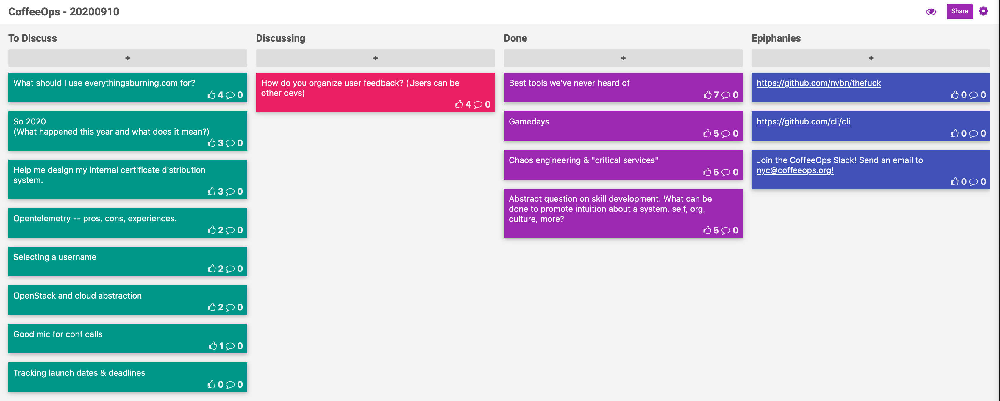

CoffeeOps 09/10/2020

All Topics
- Game Days
- Selecting a Username
- Abstract question on skill development. What can be done to promote intuition about a system, self, org, culture, more?
- What should I use everything is burning.com
- Chaos engineering and “critical services”
- Open stack and cloud abstraction
- So 2020 (what happened this year and what does it mean)
- How do you organize user feedback? (Users can be other devs)
- Good mic for conf calls
- Help me design my internal certificate distribution system
- OpenTelemetry pros, cons, experiences
- Tracking launch dates and deadlines
- Best tools we’ve never heard of

Best tools you’ve never heard of
- Something that’s come out of Rust is a bunch of rewritten CLI tools. Bat, fd, ripgrep
- The silver searcher. Useful for searching code locally (github.com/ggreer/the_silver_searcher )
- Fzf (fuzzy find?)
- thefuck github.com/nvbn/thefuck 
- landen.co (website builder)
- GitHub cli GitHub.com/cli/cli 
- GitKraken Git GUI gitkraken.com 
- GitHub.com/fairwindsops/polaris
- Popeye https://popeyecli.io/
- Kubernetes related tools - landscape.cncf.io

Gamedays
- Game days are a day where you practice something, like responding to a hypothetical incident 
- Makes it a less stressful environment but you can practice important things with real business value
- Good way to prep for disaster recovery
- Practice game days at the AWS Loft in NYC (https://aws.amazon.com/start-ups/loft/)
- Seems like a tool to build up intuition
- Set up scenarios where those with more experience create problems that they know how to fix, but make those without experience fix them so they can gain experience
- Depends on what the game day is for. Is it for building up experience for junior folks, or actually testing those with more experience in a more intense scenario
- Google has a “Wheel of misfortune” that determines what will break on a gameday

Chaos engineering and “critical services”
- How do you avoid all the things being a “critical service”?
- A system can’t be more reliable than its least reliable subsystem
- For determining what is critical, consider your user’s viewpoint. What do they expect from your service/product. What parts of the whole system can go down without totally preventing the user from accomplishing their goal
- At what point is the threshold where chaos engineering is worth while? From a business perspective, pitching turning off services is a scary thing that doesn’t immediately appear to have value
- Nothing is 100% reliable. Would you rather not know where you have reliability issues? Or find those problems and know where you have reliability issues
- If you’re achieving your business outcomes, aren’t your services reliable enough?
    - They’re only your business outcomes until they aren’t. When something critical goes down and you can’t run your business…
- Chaos engineering is a tool for building confidence in your reliability instead of relying on luck

Abstract question on skill development. What can be done to promote intuition about a system, self, org, culture, more?
- Intuition is going beyond simple learning and now its been intrinsically stored inside of you so you know it without even knowing you know it.
- It takes a lot of practice. It isn’t something that can be learned overnight
- Important to have a group to learn with and bounce ideas off of

How do you organize user feedback? (Users can be other devs)
- Joke: “I just have a bin next to my desk that I put it all in. Oh a trash can? Is that what you call that?”
- Want to keep track of feedback and be transparent, but without necessarily committing to work on something
- Want to prevent sprawl of ideas. People keep creating spreadsheets and lists and things get lost
- GitHub issues? Jira?
- Use a slack workflow that only allows you to post in a channel if you use a form
- Having a tool that would allow for transparency about ideas that have been submitted, but also WHY they have been turned down
- You don’t want to be spending all your time defending your decision to NOT do something. And also don’t want to agree to do too many things.
- This totally seems like the role of a product manager or product owner. That kind of requests/feedback probably shouldn’t go directly to the engineers?
- Microsofts user voice is an example of this done pretty well.
- Do you worry about the product becoming “list driven” and the features being totally isolated from each other? Where you just keep adding but you don’t have a strategy?
- Product managers need to control that sprawl and make sure that you have a clear strategy
