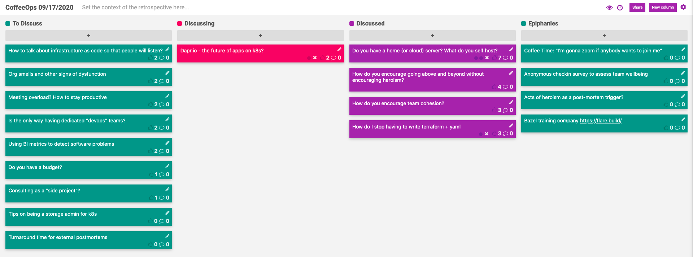

CoffeeOps 09/17/2020

All Topics
- Dapr.io - the future of apps on k8s?
- Do you have a home (or cloud) server? What do you self host?
- Tips on being a storage admin for k8s
- Is the only way having dedicated “devops” teams?
- How do you encourage going above and beyond without encouraging heroism?
- Org smells and other signs of dysfunction
- Meeting overload? How to stay productive
- How to talk about infrastructure as code so that people will listen?
- Using BI metrics to detect software problems
- Turnaround time for external postmortems
- How do I stop having to write terraform + yaml
- How do you encourage team cohesion?
- Do you have a budget?
- Consulting as a “side project”

Epiphanies
- Anonymous checkin survey to assess team wellbeing
- Acts of heroism as a post-mortem trigger
- Coffee Time: “I’m gonna zoom if anybody wants to join me”
- Bazel training company https://flare.build
- 

Do you have a home (or cloud) server? What do you self host?
- Looking to run something for fun and to learn. What do you run?
- Hosting your own k8s cluster unless you have a good reason gets really expensive really fast
- Unraid OS
- NextCloud
- FreeBSD + ZFS
- Self host a RSS reader (comma feed)
- Kubernetes on a raspberry pi cluster
- https://www.civo.com/ (hosted k3s)

How do you encourage going above and beyond without encouraging heroism?
- Someone in this meetup before mentioned a kudos channel in slack for recognizing good work without encouraging firefighting, how else can you do it?
- Going above and beyond shouldn’t be a substitute for bad engineering
- Heroism that prevents future heroism
- Do a postmortem if someone has to stay super late or pull an all-nighter. That shouldn’t be normal
- Does management promote people who aren’t heroes? If you can’t succeed without having to be a hero, that might promote a bad culture.
- Want to recognize proactive actions that pay dividends

How do you encourage team cohesion?
- When we were all in the same office, people talked a lot and worked on the same things. Now that everyone is remote, everyone just does their own thing.
- How do you decide what gets done? Any scrum or agile or anything?
    - Nope. Everyone just does what they want to?
- Encourage people to pair!
- Maybe have team meetings to list out work items and vote on what is important so that things get done
- Just got a kanban board for tracking work, so hoping that will help with things as well.
- All your questions are great interview questions!
- Track how many people show up to standup. There really isn’t any reason for everyone to not show up to standup.
- Standup is a part of your job. You have to be there. It should only be 15 minutes tops, so it shouldn’t be that painful.
- If you don’t like end of day happy hours or whatever, how do you build up the team?
    - Random slack channels for memes or fun stuff
- There are a lot more barriers to interaction when remote than if you were physically in the same space. Instead of talking to each other in the kitchen at the office, now you have to schedule a zoom call.
- Could try the “forever zoom”, or a perpetual call that people can stay in and ask questions and stuff
- “Coffee time” where anyone can blast the channel and say they’re sitting for a coffee for 5 minutes, and anyone can join them on the zoom
- https://www.donut.com/ for one on ones with random people

How do I stop having to write terraform + yaml
- Tired of writing plain terraform and yaml. Feels like there has to be a better way
- If you want to write Golang, use Terratest
- AWS’s various CDKs that use TypeScript or Python to generate CloudFormation, k8s yaml, or Terraform
    - https://www.youtube.com/watch?v=wIfnkN_T6Eo&t=450s
    - https://www.npmjs.com/package/cdktf-cli
- Pulumi
- Gotta find other things that are learning opportunities because terraform and yaml now are boring because you’re good at them.
- When does a problem justify using an imperative solution?

Dapr.io - the future of apps on k8s?
- Abstracts away all common functionalities of an application like pub/sub, key value store, service discovery in http/Grpc
- Runs as an operator in your cluster and injects a sidecar into each pod, then you have http endpoints available at localhost within the pod for handling all those common things.
- Want to store a value in a database? Make an http request to localhost. Want to subscribe to a Kafka topic? Expose an http endpoint
