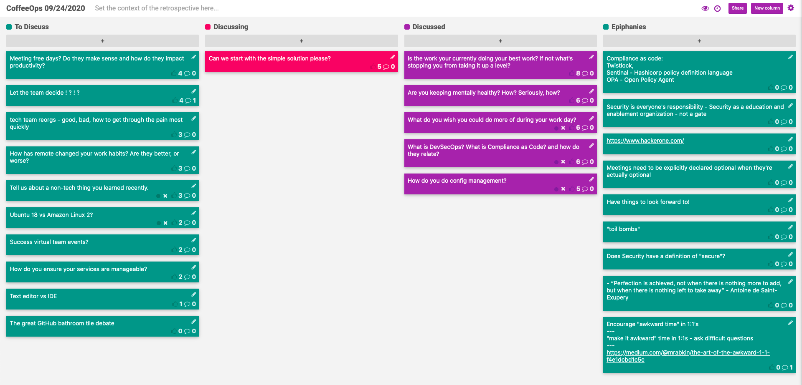

CoffeeOps 09/24/2020

All Topics
- What do you wish you could do more of during your work day?
- Is the work you’re currently doing your best work? If not what’s stopping you from taking it up a level?
- Are you keeping mentally healthy? How? Seriously, how?
- How has remote changed your work habits? Are they better, or worse?
- The great GitHub bathroom tile debate
- Ubuntu 18 vs Amazon Linux 2?
- Let the team decide ! ? ! ?
- What is DevSecOps? What is Compliance as Code? And how do they relate?
- Tech team reorgs - good, bad, how to get through the pain most quickly
- How do you do config management?
- OpenStack and other cloud abstraction tools
- Tell us about a non-tech thing you learned recently.
- Meeting free days? Do they make sense and how do they impact productivity?
- Text editor vs IDE
- How do you unsure your services are manageable?
- Can we start with the simple solution please?
- Success virtual team events?

Epiphanies
- Meetings need to be explicitly declared optional when they’re actually optional
- Have things to look forward to!
- Encourage “awkward time” in 1:1s. Ask the difficult questions
    - https://medium.com/@mrabkin/the-art-of-the-awkward-1-1-f4e1dcbd1c5
- hackerone.com
- Compliance as code: Twistlock, Sentinel, OPA
- Security is everyone’s responsibility: security as an education and enablement organization - not a gate
- “Perfection is achieved, not when there is nothing more to add, but when there is nothing left to take away” - Antoine de Saint-Exupery

Is the work you’re currently doing your best work? If not what’s stopping you from taking it up a level?
- If you feel like you’re not satisfied with what you’re currently doing, why can’t you do something better?
- Might be stopping yourself? Laziness? Depression?
- Not having a shared bigger plan. Some people just want to start running, but don’t have a clear direction
- Being bogged down by a big backlog of stuff, and not having the team bandwidth to trudge through it.
- Feeling like you can’t get to real work, and when you do, that its so small that it doesn’t make a difference
- Being stuck in meetings or company politics
- What is your best work? Writing the cleanest code? Impacting the most people? Can be hard to know sometimes.

Are you keeping mentally healthy? How? Seriously, how?
- Work isn’t easy and keeping mental health down, but quarantine is exacerbating that for everyone. What strategies have you found to help keep your mental state healthy?
- Set aside a part of your day where your coworkers aren’t working, and work then so you don’t get interrupted and can focus on something important
- After a really long Zoom call, it takes like 30 minutes to get back into things and start to actually be productive again
- Seen a definitive increase in conflict/aggression in communication at work
    - Assume good intentions, because over text it can be so hard to determine tone
- And a definitive increase in meetings
- And an increase in isolation, because of an absence of in person communication and having “real conversations”
- Spotify made a change in culture to go from the expectation that everyone is involved in everything, to everyone only needs to be involved in what they want to, to try to reduce cognitive load and stress
- Be clear about if meetings being optional. Don’t make people waste their time in meetings that don’t apply to them
- We’ve primarily chatted about work, but the world is pretty shitty too right now. Plenty of non-work things to bring down your mental health.

What do you wish you could do more of during your work day?
- Have to write RFCs and wish I could do more research and messing around
- Keeping getting assigned to the rotation of doing “toil” work, or burning through tech debt. Wish I could do LESS of that.

What is DevSecOps? What is Compliance as Code? And how do they relate?
- Continuously improving your security mindset
- Improve how you involve security in your process
- Bake security into your CI
- Architect the underlying platform so that certain things aren’t possible
    - Don’t expose certain ports
    - Don’t make public load balancers
    - Don’t allow DBs without a password
- Twistlock for runtime vulnerability
- HackerOne for security checks and bug bounties
- Terraform sentinel
- Open Policy Agent
- If you do a security audit or pen test, should the results be shared with the whole team?
    - At least to an extent, but at a huge org, can you trust that every single person wouldn’t exploit something, or leak something?
- Does your security team have definitions for what is actually secure? Or is it “I know it when I see it” kind of thing

How do you do config management?
- Do you use Ansible? Do you do GitOps?
- What is config management?
    - Usually a declarative manner of saying what is running on a server. What is installed, what files are present
    - Tools like:
        - Ansible
        - Chef
        - Puppet
        - AWS SSM
- Whatever tool you go with, try to get a single tool for the whole org, so that things are standardized. Having it segmented across the org is a pain and makes things incompatible

Can we start with the simple solution please?
- Spend a lot of time talking people down from really complex, over the top solutions. Why do people not want to start simple?
- “Perfection is achieved, not when there is nothing more to add, but when there is nothing left to take away” - Antoine de Saint-Exupery
- Does the team have so much time that they can spend all their time working on these complex problems?
