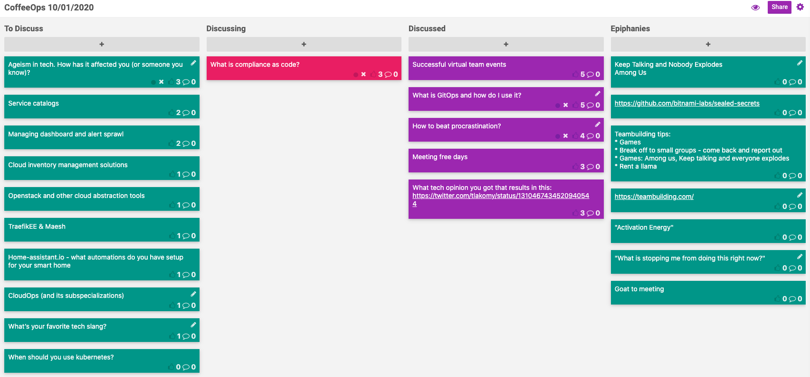

CoffeeOps 10/01/2020

All Topics
- Managing dashboard and alert sprawl
- Home-assistant.io - what automations do you have setup for your smart home?
- Successful virtual team events
- Meeting free days
- Openstack and other cloud abstraction tools
- Cloud inventory management solutions
- Service catalogs
- TraefikEE & Maesh
- What is GitOps and how do I use it?
- How to beat procrastination?
- Ageism in tech. How has it affected you (or someone you know)?
- What’s your favorite tech slang?
- What is compliance as code?
- CloudOps (and its subspecializations)
- When should you use kubernetes?
- What tech opinion you go that results in this: https://twitter.com/tlakomy/status/1310467434520940544

Epiphanies
- teambuilding.com
- Teambuilding tips:
    - Games
        - Keep Talking and Nobody Explodes
        - Among Us
    - Break off to small groups - come back and report
    - Games: Among us, Keep talking and everyone explodes
    - Rent a llama
- Goat to meeting
- https://github.com/bitnami-labs/sealed-secrets
- "Activation Energy"
- Re: procrastination: "What is stopping me from doing this right now?"

Successful virtual team events
- Team building maybe more important now than ever, but hard to do
- Had some zoom events, but they were mostly weird and awkward
- Hired teambuilding.com and they hosted a historical murder mystery thing. Would recommend
- Among us (https://store.steampowered.com/app/945360/Among_Us/)
- Jackbox.tv
- https://kahoot.com/
- Large scale happy hour does not seem to ever go well

What is GitOps and how do I use it?
- https://www.gitops.tech/
- What is GitOps?
    - Thought it was the process of having all aspects of your application and infrastructure stored in code
    - Thought it was having the state of production match what’s in your repo
- Production matches your repo
- “Versioned CI/CD on top of declarative infrastructure” - Kelsey Hightower
- Isn’t just the same thing that we’ve always done if you used version control?
    - Mostly the same, but not everybody does this, and not everybody uses git
    - Kinda nice to put a buzzword term on it so that everybody gels around a single pattern

How to beat procrastination?
- Find a way to just get started, even if its the smallest little thing, which might help you get over the inertia
- anti-Anxiety medication
- Build up a routine
- “To Done list”, or a list of things you’ve gotten done so you can see what you’ve accomplished

Meeting free days
- Does it help as a manager when meetings are your job?
- Needs company buy-in
- People ignore "please review this"; at meetings people suddenly have opinions
- Useful meetings require an agenda and goal. Make the meetings you do have to have useful
    - If it isn't done, cancel or postpone the meeting
- Standups as social interaction
- Lower the social cost of canceling recurring meetings. Play defense on recurring meetings.

What tech opinion you got the results in this: https://twitter.com/tlakomy/status/1310467434520940544
- Literally any change
    - Python 2 -> 3
    - OS's: CentOS 6, Ubuntu 16.04
- Why does this happen more at bigger companies?
    - People don't want to learn how new things work
    - Resume driven development
    - Harder to complete a thing
    - It's not in the plan; it's too damn much work
    - Incentive is on points and velocity
        - The thing thats measured is the thing people optimize on

Compliance as code
- Sentinel in Hashicorp
    - Complicance automation
        - Twistlock: uses GUI - so not code, so forces containers to comply with definitions
        - Sysdig/Falco: FOSS project. Like Twistlock. Provides a security perimeter around you containers.
        - Digs into process namespace. Runs as a privileged container.
- But WHAT IS IT?
    - Defining your compliance requirements in a human- and machine-readable language. OPA/Sentinel/etc
- Better than throwing lots of manpower at the problem!