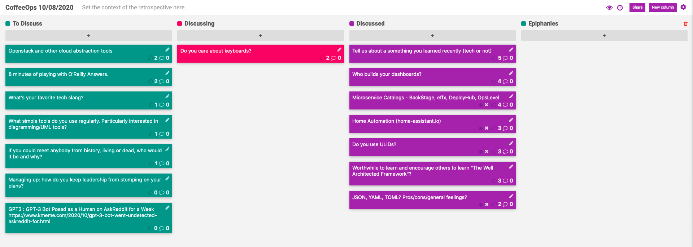

CoffeeOps 10/08/2020

All Topics
- Microservice Catalogs - Backstage, efflux, DeployHub, OpsLevel
- Who builds your dashboards?
- If you could meet anybody from history, living or dead, who would it be and why?
- Do you use ULIDs?
- Managing up: how do you keep leadership from stomping on your plans?
- What’s your favorite tech slang?
- Tell us about something you learned recently (tech or not)
- Home Automation (home-assistant.io)
- Openstack and other cloud abstraction tools
- Worthwhile to learn and encourage others to learn “The Well Architected Framework”
- JSON, YAML, TOML? Pros/cons/general feelings?
- Do you care about keyboards?
- What simple tools do you use regularly? Particularly interested in diagramming/UML tools?
- 8 minutes of playing with O’Reilly Answers

Epiphanies

Tell us about something you learned recently (tech or not)
- https://github.com/clockworksoul/today-i-learned/blob/master/README.md
- https://github.com/schollz/croc
- In Node.js, you can send a signal to the process to enable debugging
- http://porkmail.org/era/unix/award.html
- https://explainshell.com/
- https://tldr.sh/
- Puppies don’t open their eyes for the first 1-2 weeks of their life
- There is a praise feature in Microsoft Teams

Microservice Catalogs - Backstage, efflux, DeployHub, OpsLevel
- We have an internal service that manages this ownership catalog. Useful for people on call to look up who to contact when things go wrong. Even ties into deployment system so you can’t deploy unless an entry exists for the service
- Is this kind of thing a pain point for people trying to deploy? Or do people enjoy it?
    - Yes? Its a pain to fill it out, but when you need it, its really useful.
- API based home grown service
- Web page option to browse also

Home Automation (home-assistant.io)
- Home assistant is a really cool tool that allows for total control over a smart home
- Really powerful automations
    - Turn lights lights on if I’m home, and its after 2pm and the sun is below 20 degrees above the horizon
- So many integrations. Literally thousands.
- Hue bulbs
- Wemo smart switches
- Even works with security systems, thermostats, etc.
- Need some smart home stuff for this to be useful

Do you use ULIDs?
- Kind of like a UUID, but includes a timestamp, so you can sort them by age
- 48 bits of timestamp, then 80 bits of random
- Can sort by timestamp, then random
- https://github.com/ulid/spec
- Reminds me of Twitter snowflake
- https://github.com/twitter-archive/snowflake
- https://blog.twitter.com/engineering/en_us/a/2010/announcing-snowflake.html

Who builds your dashboards?
- Combination of SRE and app teams. SREs build automated dashboards. App team builds “at-a-glance” dashboards for their specific needs
- Just having dashboards doesn’t mean you have increased information/wisdom about what is happening
- Dashboard generation is part of shifting left, and providing self service production capabilities to the app teams
- What’s the problem with having so many dashboards?
    - Duplication of work. Must be missing guidance on how to make complete/useful dashboards, because people try to recreate the wheel when it comes to making new dashboards, and many don’t do it right.
- Sounds like dashboard lifecycle management is necessary
- Using Grafana to do dashboards, so working to codify dashboards by putting the dashboard JSON in code.

Worthwhile to learn and encourage others to learn “The Well Architected Framework”
- AWS specific
- Started as a series of white papers. Now integrated into their trainings, certifications, and services.
- 5 pillars
    - Operational Excellence
    - Security
    - Reliability
    - Performance Efficiency
    - Cost Optimization
- Lots of people do these things (the “-ility”s), but AWS has given it a name. (Well Architected Framework)
- Very reminiscent of the 12 factor app (https://12factor.net/)

JSON, YAML, TOML? Pros/cons/general feelings?
- JSON is for machines communicating with machines because you can’t put comments in it
- Sounds like YAML is more expressive than JSON
- People need to be better at naming things, but you can’t also expect people to be perfect at naming
- Names can be good, but values might not be obvious. Comments can help explain it.
- Comments help explain context/decisions. Shouldn’t just explain WHAT the code does.
- YAML anchors are useful for preventing myself from duplicating lots of work
