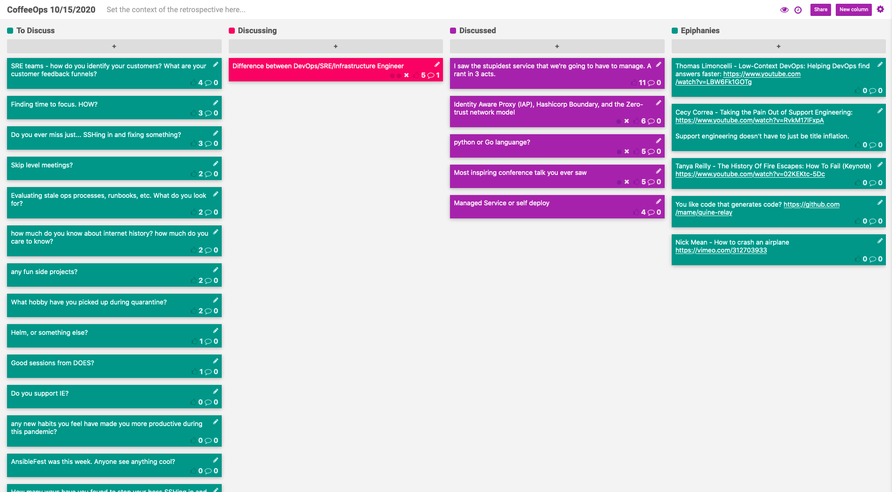

CoffeeOps 10/15/2020

All Topics
- Identity Aware Proxy (IAP), Hashicorp Boundary, and the Zero-trust network model
- Do you support IE?
- What hobby have you picked up during quarantine?
- SRE teams - how do you identify your customers? What are your customer feedback funnels?
- Managed Service or self deploy
- Helm? Or something else
- Finding time to focus. HOW?
- Skip level meetings?
- Good sessions from DOES?
- How much do you know about internet history? How much do you care to know?
- Do you ever miss just…SSHing in and fixing something?
- I saw the stupidest service that we’re going to have to manage. A rant in 3 acts
- Any new habits you feel have made you more productive during this pandemic?
- Difference between DevOps/SRE/Infrastructure Engineer
- Evaluating stale ops processes, runbacks, etc. What do you look for?
- How many ways have you found to stop your boss SSHing in and “fixing” things?
- AnsibleFest was this week. Anyone see anything cool?
- Most inspiring conference talk you ever saw
- Any fun side projects?
- Python or Go language?

Epiphanies
- Tanya Reilly - The History of Fire Escapes: How to Fail (Keynote) https://www.youtube.com/watch?v=02KEKtc-5Dc
- You like code that generates code? https://github.com/mame/quine-relay
- Thomas Limoncelli - Low-context DevOps: Helping DevOps find answers faster: https://www.youtube.com/watch?v=LBW6Fk1GOTg

I saw the stupidest service that we’re going to have to manage. A rant in 3 acts
- Hardware bound licensed
- No encryption at any point
- Java EE app wrapped around a bunch of Perl
- Installer is only interactive…no programmatic mode

Identity Aware Proxy (IAP), Hashicorp Boundary, and the Zero-trust network model
- Hashicorp launched Boundary yesterday
- Instead of a traditional private network and then a VPN into it, boundary is your alternative
- Boundary ties into your IdP, and maps users/roles to backend services that they are allowed to access
- Creates tunnels from the public internet to these backend services
- Boundary supposed to tie into Hashicorp Vault to allow for generating temp credentials. Also will integrate with AWS, Consul, K8s etc so it can dynamically pick up new backend services that come/go

Python or Go Language
- Trying to pick up another language. Historically always thought that Python would be the thing to learn, but in the DevOps field, seeing a lot of Go as a requirement
- Which is better to learn? Is there a big difference?
- If you’re building tooling or anything distributed, probably Go. If you’re doing scripting, maybe Python
- A lot of DevOps open source tooling and products are written in Go
- If you’re working on the business logic and glue, its probably Python
- Python is a vast language with a lot of users and a big community
- Go has types and can be really beneficial for developer productivity
- Python probably is easier to get up and running

Most inspiring conference talk you ever saw?
- Nick Mean: How to crash an airplane https://vimeo.com/312703933
    - Reminds of the discovery channel show Air Disasters
- Liz Fong Jones: https://devopsdays.org/events/2019-new-york-city/program/liz-fong-jones
- Tanya Reilly - The History Of Fire Escapes: How To Fail (Keynote) https://www.youtube.com/watch?v=02KEKtc-5Dc
- Thomas Limoncelli - Low-Context DevOps: Helping DevOps find answers faster: https://www.youtube.com/watch?v=LBW6Fk1GOTg
- https://www.youtube.com/watch?v=RvkM17lFxpA

Managed Service or self deploy
- Thought about this while watching Hashiconf and they announced their managed service cloud. Do you prefer managed services or self hosting? Why?
- You might just save money by using a managed service instead of paying engineers to maintain it
- Question of control too. If a service lays in your critical path, are you okay with it going down when you don’t have an alternative?
- Also a question of data security. Are you okay with letting that company data going to a third party outside of your company? If no, you’ll have to self host.
- When you use a hosted service, you might have less control over when it goes down. Might lead you to feeling helpless. Even if you’re less efficient running it in house, you at least feel like you have control over what happens

Difference between DevOps/SRE/Infrastructure Engineer
- Mostly just in Title/pay
- DevOps is a culture, not a title. If you have the title, you’re probably not really doing DevOps?
- SRE tend to embed in teams
- Infrastructure engineer probably comes out at a larger company where you can specialize
- https://www.youtube.com/watch?v=uTEL8Ff1Zvk
