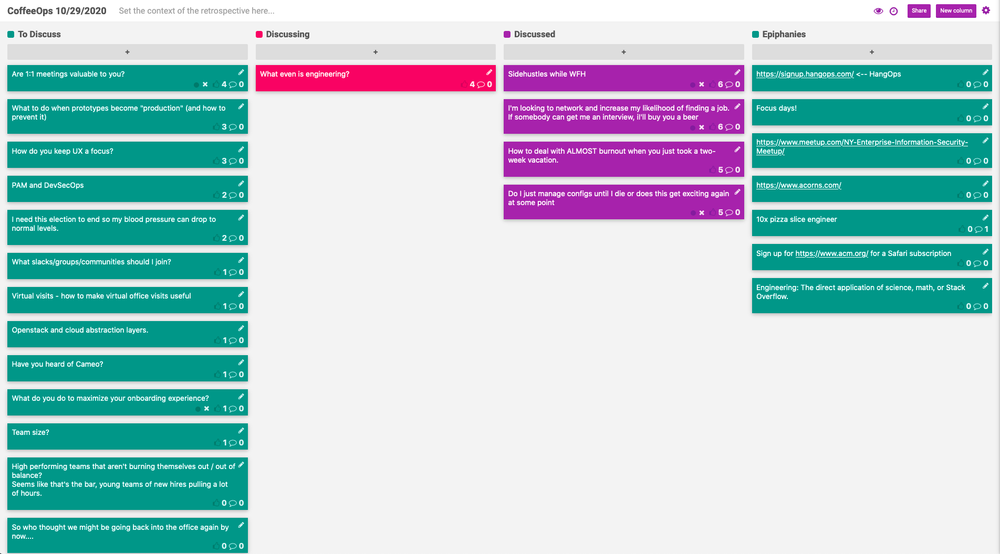

CoffeeOps 10/29/2020

All Topics
- I need this election to end so my blood pressure levels can drop to normal levels
- What hobby have you picked up during quarantine
- Virtual visits - how to make virtual office visits useful
- I’m looking to network and increase my likelihood of finding a job
- Are 1:1 meetings valuable to you?
- PAM and DevSecOps
- What to do when prototypes become “production” (and how to prevent it)
- What do you do to maximize your onboarding experience
- High performing teams that aren’t burning themselves out/out of balance? Seems like that’s the bar, young teams of new hires pulling lots of hours.
- So who thought we might be going back into the office again by now…
- Team size?
- Openstack and cloud abstraction layers
- How to deal with ALMOST burnout when you just took a two week vacation
- Sidehustels when WFH
- Have you heard of cameo
- What slacks/groups should I join
- Do I just manage configs until I die or does this get exciting again at some point
- What even is engineering
- How do you keep UX a focus

Epiphanies
- 10x pizza slice engineer
- acorns.com
- signup.hangops.com
- Sign up at acm.org for an Oreilly safari subscription
- Focus days!
- Engineering: The direct application of science, math, or stack overflow

Sidehustles while WFH
- More flexibility when working from home. What are you considering doing
- Day trading (probably not a good idea). 
- Acorns.com
- Catching up on studying and reading programming textbooks that you didn’t get to read in school
- Oreilly subscription! Read all the things
- Writing a book
- Blog writing and publishing YouTube videos

I’m looking to network and increase my likelihood of finding a job. If someone can get me an interview, I’ll buy you a beer!
- Help Boris find a job!
- https://signup.hangops.com/
- nyc@coffeeops.org to join the coffeeops slack
- https://twitter.com/shehackspurple and #cybermentoringmonday
- https://www.forbes.com/sites/louiscolumbus/2020/06/16/top-10-most-popular-cybersecurity-certifications-in-2020/#50b1d3da3f51

How to deal with ALMOST burnout when you just took a two-week vacation
- Sometimes you feel like you need a vacation and then get back from one and feel like you need a vacation from the vacation
- When you have unlimited PTO, it means much of time that people don’t know how many days to take off
- Is PTO really the answer to burning out?
- Seems like the only thing that helps is thinking about long term goals. Can help avoid the existential dread
- Been experimenting with “focus days”. You have to deal with so much context, messages, alerts, etc. So instead you get to block that out for a whole day and only work on one thing. Almost like PTO, but instead you work on specific stuff.
- Try to build the relaxation into your day instead of trying to only relax when you’re on vacation

Do I just manage configs until I die or does this get exciting again at some point?
- Feels like I pretty consistently finding the same solutions to the same problems, and its always picking an open source tool and managing the configurations. It isn’t very stimulating
- Everything is just plumbing
- On the other hand I yearn for a boring job because having to deal with people problems is draining
- When I think of popular people in DevOps space, their careers sound exciting and full of building new things…but that seems unattainable when everything is just changing yaml files
- Sounds like you’re describing toil, and organizations have a lot of it

What even is engineering?
- Got started in help desk in a data center. Doubled pay by jumping to an “engineering” titled job, but the work was all toil. People seem to think that help tech work isn’t engineering
- If you take it out of the software context, some people might think of it like the people who design the cars versus the mechanic who fixes it?
- Engineering isn’t something that you learn by reading books, its something that you apply by working on stuff
- Seems like engineers can be pretentious jerks, and look down upon anyone who comes from a support background
- Its classicism!
- Support folk should be good at engineering! They have to troubleshoot, find their way in a novel situation and then automate the solution!
- With the analogy of the mechanic and the mechanical engineer who builds the car, it seems like there could be a middle ground where the mechanic knows the car so well that they could build one on their own
- Engineering is the application of science/math etc to solve problems
