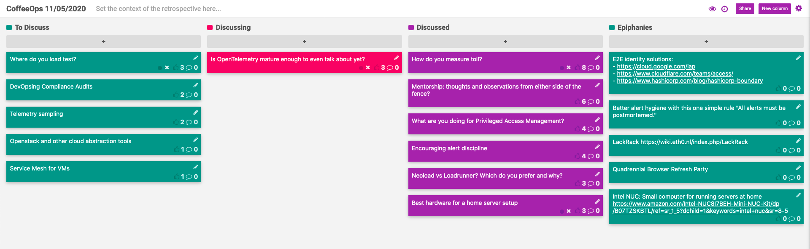

CoffeeOps 11/05/2020

All Topics
- Telemetry sampling (or polling theory for DevOps)
- Openstack and other cloud abstraction tools
- DevOpsing Compliance Audits
- How do you measure toil?
- What are you doing for Privileged Access Management?
- Where do you load test?
- Service Mesh for VMs
- Mentorship: thoughts and observations from either side of the fence?
- Is OpenTelemetry mature enough to even talk about yet?
- Encouraging alert discipline
- Neoload vs Loadrunner? Which do you prefer and why?
- Best hardware for a home server setup

Epiphanies
- E2E identity solutions:
    - cloud.google.com/iap
    - cloudflare.com/teams/access
    - Hashicorp.com/blog/hashicorp-boundary
- Better alert hygiene with this one simple rule: “All alerts must be postmortem”
- LackRack https://wiki.eth0.nl/index.php/LackRack
- Quadrennial Browser Refresh Party = Election
- Intel NUC: Small computer for running servers at home https://www.amazon.com/Intel-NUC8I7BEH-Mini-NUC-Kit/dp/B07TZSKBTL/ref=sr_1_5?dchild=1&keywords=intel+nuc&sr=8-5

How do you measure toil?
- Org has been trying to measure all the things, some of which are difficult to measure, such as toil.
- Low hanging fruit:
    - How many support tickets are open
    - How long do they stay open?
- Are there other metrics you can look at to measure toil
- How to define toil?
    - Any repetitive, often manual, interrupting tasks that are just meant to keep things afloat as opposed to moving the ball forward?
- The goal is to measure toil so that you can optimize around it and prioritize reducing the amount of toil, which might help morale
- Can you take the ticket based approach and label stories that are toil?
- Or do the inverse? Measure how much work is non-toil?
- This kind of thing tends to be a self-reported metric that you track in a spreadsheet or something
- One interesting option is that whoever is on call is expected to do NO product work, and only respond to support tickets. If they don’ have support tickets to work on, they can work on whatever they want to make things better
- Having one person dedicated to toil at a time makes it easier to measure
- Make a list of high level tasks you’re doing when doing toil work. Do a checkbox each time you do it. Helps you identify WHAT are your toilsome tasks
- A weekly team survey or something about how productive your work was, and how much is toil

Mentorship: thoughts and observations from either side of the fence?
- What are some traits of good/bad mentors/mentees?
- Only talking, and not checking in that your mentee is comprehending what you are saying
- Mentor should answer questions, but sometimes helping the mentee find the answer on their own is more powerful for learning
- Figuring out whether you need to give a direct answer or a guiding answer is a difficult skill to learn as a mentor
- The relationship between a mentor/mentee might depend heavily on how you became a mentor/mentee. Were you forced together? Did you choose each other?
- Need to be present in a mentor/mentee relationship for it to be successful
- Have heard that mentor/mentee relationships are a long drawn out process, but there might be just as much validity in a short term engagement
- Make it an expectation on the senior engineers that they should be guiding/mentoring junior engineers, instead of making it a responsibility for the junior to find a mentor
- If you have multiple people simultaneously, its not a mentorship, its a classroom

What are you doing for Privileged Access Management?
- All controlled with AWS SSO via Active Directory
- Custom SSO that maps to IAM roles
- Okta
- Considering Hashicorp boundary
- Similar to Google IAP or Cloudflare Access
- How are those different from AWS SSO or Okta?
    - Those are meant primarily for logging into SaaS products or service providers. BeyondCorp stuff can even provide access to individual servers/databases etc.
- How do you determine who gets what access? If someone requests elevated access, do you give it to them?
    - All controlled via help desk tickets/requests.
    - Human approval process

Encouraging alert discipline
- How do you make sure people actually respond to alerts when they come in?
- Fire them if they don’t (half joking)
- If you have so many alerts that people are ignoring them, you can probably improved your alert hygiene
- If something is down and you’re getting paged, you need to respond! Sounds like a primary job function
- One of the problem with Slack alerts is that easily there can be way too many alerts, and people learn to ignore them
- Every alert should be actionable!
- Might be more of a cultural thing than a tech/practice thing. Have to practice empathy around determining what is a good alert, and ensuring that you respond to alerts.
- If everyone is on call, then everyone is motivated to not be woken up in the middle of the night

Best hardware for a home server setup
- Intel Nuc
- Raspberry pi
- Old Mac mini
- Why not a cloud server?
    - Totally could, just the tinkering aspect really
- Old laptop on eBay or something
- IKEA lack rack. Little side table that’s the same width as a normal server rack, so you can screw servers into the lack.
- https://www.reddit.com/r/homelab/

Is OpenTelemetry mature enough to even talk about yet?
- Opentelemetry is a combination of OpenTracing and OpenMetrics
- Its RC now at least?
- https://github.com/open-telemetry
- https://opentelemetry.io/
- It integrates with a lot of providers already, and since its a CNCF project, likely won’t have a single provider influence the implementation too much
