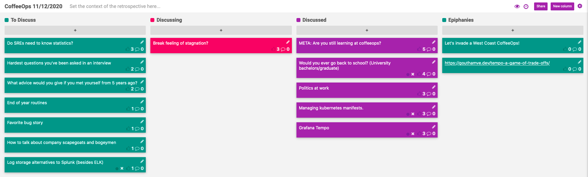

CoffeeOps 11/12/2020

All Topics
- Grafana Tempo
- End of year routines
- Favorite bug story
- Managing kubernetes manifests
- Log storage alternatives to Splunk (besides ELK)
- Hardest questions you’ve ever been asked in an interview
- Politics at work
- How do you get alerts?
- Break feeling of stagnation?
- Do SREs need to know statistics?
- How to talk about company scapegoats and bogeymen
- Would you ever go back to school? (University bachelors/graduate)
- What advice would you give if you met yourself from 5 years ago?
- META: are you still learning at coffeeops?

Epiphanies
- https://gouthamve.dev/tempo-a-game-of-trade-offs/

META: are you still learning at coffeeops?
- Was reminiscing about first joining coffeeops and how I learned a lot quickly. Now I have a good time, but I don’t learn nearly as much regularly.
- Anybody else feel similarly?
- We have a pretty solid regular group, and you pick up on all their knowledge over time
- Teaching newcomers can be just as much fun as learning when you are a newcomer
- It seems like our discussions have largely shifted from discussing current practices to discussing new tools that have come out
- Feeding off of others energy in the group towards devops culture helps to keep you on the right path
- Covid probably isn’t helping. Things are a bit like Groundhog Day
- We could maybe join into other groups coffeeops or invite others to join ours?

Would you ever go back to school? (University bachelors/graduate)
- Could potentially audit classes in other disciplines
- The cost is likely really high
- The benefit of a real in person university is the structure and the experience, as opposed to the actual knowledge for the most part
- Have to decide what you want to get out of school. Are you getting exposed to new things? Do you want to dive deep on something?
- It would be nice to be a programmer in a group of non-programmers instead of a programmer in a group of only programmers. Could be nice to do some kind of fellowship in another industry, but as a programmer
- It seems like in the western world, going back to school is one of the only accepted things you can do during an extended break from work

Politics at work
- Been a very political time outside of work, so it seems like political discussions at work at inevitable
- It seems like leadership generally discourages political discussions
- Expensify publicly endorsed Joe Biden and sent an email to ALL their customer base, which annoyed people.
- Many companies instead embrace the ideal of “bringing your whole self to work” kind of deal, where they want you to engage in these kind of discussions
- Someone’s family member worked in Alabama and at a company outing, a prize in a competition was an AR-15
- If you assume that everyone around you shares the same beliefs, it can be really easy to say things that someone with opposing views might find offensive

Managing kubernetes manifests
- Been writing lots of kubernetes manifests by hand
- Ready to start templating them etc. What options are out there?
- Helm seems a little bit heavy?
    - Can use “helm template” so that it dumps out yaml that you can apply instead of having it manage it for you
- Kustomize is an option, but what do others use?
- Terraform has a kubernetes provider
- Cdk8s https://youtu.be/wIfnkN_T6Eo
- Hard to beat “helm upgrade” with a new image tag
- Helm is a lot better in helm 3 since you no longer need tiller
- jsonnet?
- What’s wrong with the kubernetes terraform provider?
    - Was missing some resources
    - Was missing ability to set annotations and labels. If k8s set it their own, terraform would undo it
- ArgoCD, a nice gitops tool that can use kustomize, helm or just raw yaml 

Grafana Tempo
- New distributed tracing tool that supports common tracing formats
- The big differentiator is that it only depends on Object storage (s3 or alternatives). No database
- https://gouthamve.dev/tempo-a-game-of-trade-offs/
- Both tempo and Loki are made of three parts. An ingester that takes in logs/tracing segments, buffers them, and writes to storage. A querier that checks the buffer or your object storage and returns results. A compactor that checks object storage for things that can be compacted together for reduced storage usage and faster querying

Break feeling of stagnation?
- Feel like I’ve surrounded myself with similar people who are interested in all the same things. How can I break out of that and learn new things and grow?
- Hard during covid because its difficult to go out and experience new things
- Without any variation, you grow to not appreciate what you’ve got
- Grass is greener situation
- https://www.amazon.com/Designing-Your-Work-Life-Happiness-ebook/dp/B07ZC8SK83
- There’s always an opportunity to reinvent yourself and try something new
